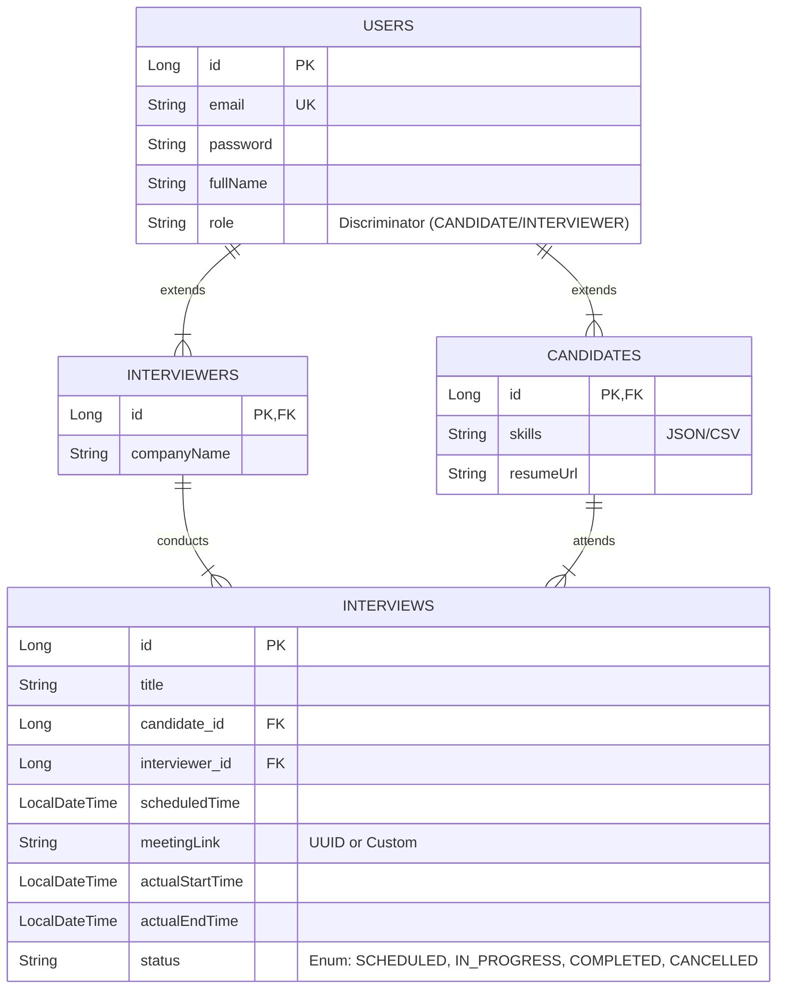

# API & Database Design Documentation

## 1. Database Schema

The database uses a relational model with **PostgreSQL**, leveraging **Hibernate Inheritance (JOINED strategy)** for User roles.

### Entity Relationship Diagram (ERD)

---

## 2. REST API Endpoints

### Authentication (`/api/auth`)

| Method | Endpoint | Description | Request Body | Response |
| :--- | :--- | :--- | :--- | :--- |
| `POST` | `/signup` | Register a new user | `SignupRequest` { email, password, fullName, role, ... } | `JwtResponse` { token, type, id, email, roles } |
| `POST` | `/login` | Authenticate user | `LoginRequest` { email, password } | `JwtResponse` { token, ... } |

### User Management (`/api/users`)

| Method | Endpoint | Description | Response |
| :--- | :--- | :--- | :--- |
| `GET` | `/profile` | Get current user profile (with role-specific fields) | `UserProfileDTO` { id, email, fullName, role, skills, resumeUrl, companyName } |

### Interview Management (`/api/interviews`)

| Method | Endpoint | Description | Request Body | Response |
| :--- | :--- | :--- | :--- | :--- |
| `POST` | `/schedule` | Schedule a new interview | `ScheduleRequest` { interviewerEmail, candidateEmail, candidateName, scheduledTime, title, meetingLink } | `Interview` object |
| `GET` | `/session/{meetingLink}/queue` | Get the queue/timeline for a session | N/A | Map { "current": Interview, "timeline": [Interview] } |
| `POST` | `/{id}/start` | Manually start an interview (changes status to IN_PROGRESS) | N/A | 200 OK |
| `POST` | `/{id}/complete` | Complete current interview (changes status to COMPLETED) | N/A | `Interview` (Next scheduled interview or null) |
| `GET` | `/{id}/status` | Get status of specific interview | N/A | Map { "status": "..." } |
| `POST` | `/{id}/remind` | Send reminder email to candidate | N/A | String message |
| `GET` | `/candidate/upcoming` | Get upcoming interviews for candidate | Query Param: `email` | List<Interview> |

---

## 3. Key Implementation Details

### Security
*   **JWT Authentication**: Used for securing endpoints (currently configured directly in `SecurityConfig`).
*   **Role-Based Access**: `CANDIDATE` and `INTERVIEWER` roles are distinguished at the Entity and DTO level.
*   **Public Access for Testing**: Temporarily, `/api/interviews/**` is open to facilitate testing without complex auth flows.

### Queue Management Logic
*   **Session-Based**: Interviews are grouped by `meetingLink`.
*   **Manual Control**: The interviewer manually transitions candidates from `SCHEDULED` -> `IN_PROGRESS` (Call In) -> `COMPLETED`.
*   **Persistence**: Interviewer session persists through candidate switches using WebSocket updates and specific UI logic.
