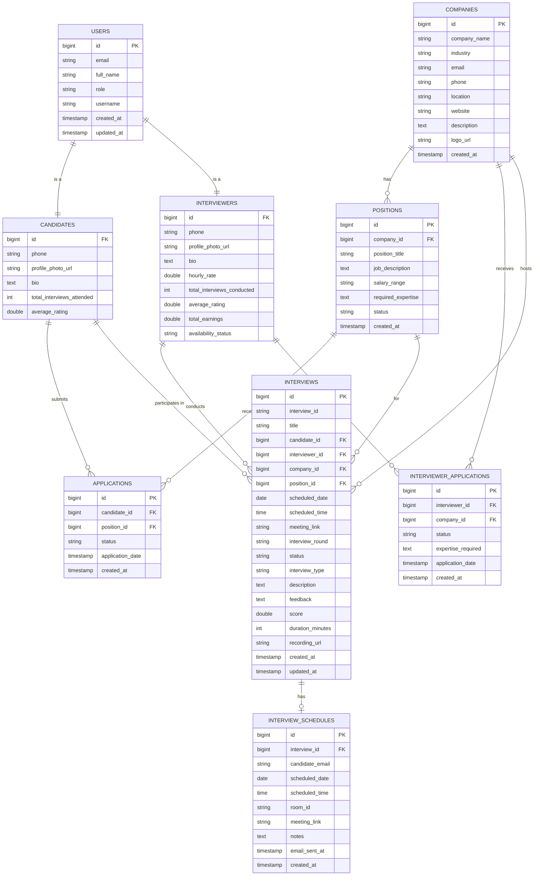
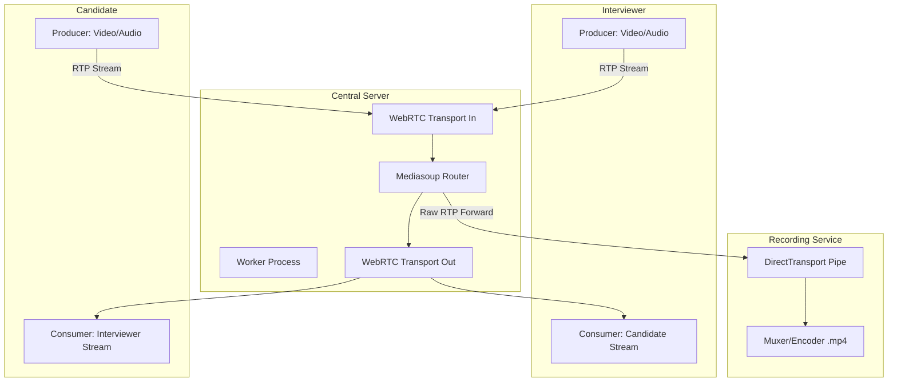
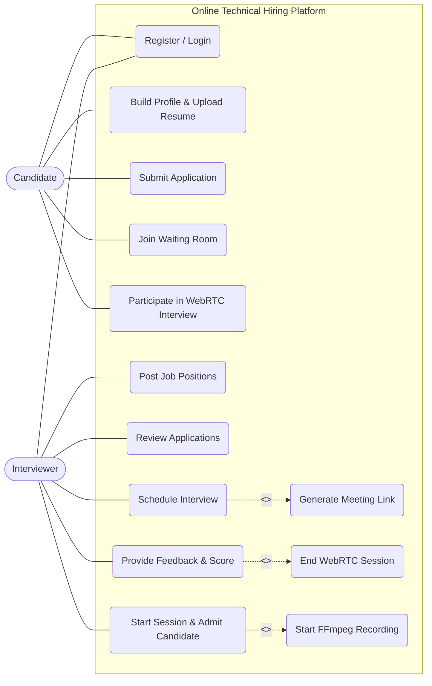
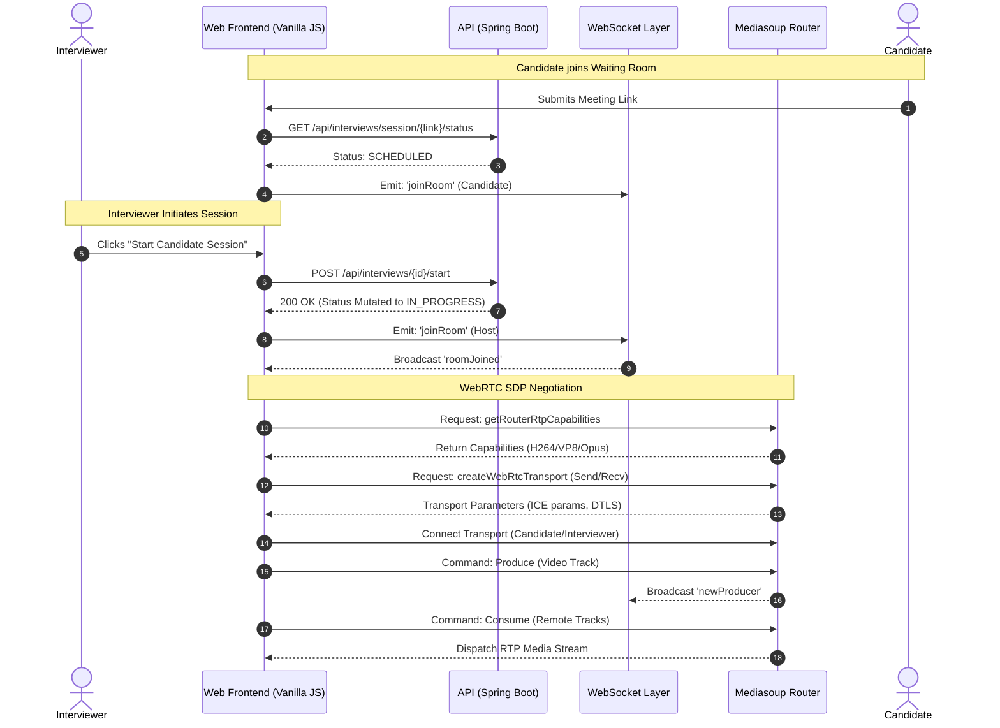
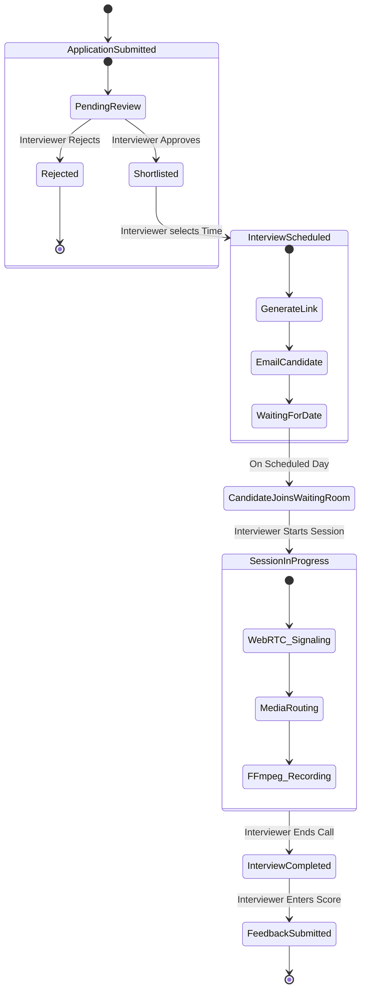

[PeerChat AI Platform]  peerchat.app support@peerchat.app
DDU(Dept. of IT)  Page | 1

# Project Report on
# Online Technical Hiring Platform (PeerChat)

**BTech IT, Sem VI**

**Prepared By:**
- **[Student 1 Name]** ([IT-[Roll No 1]])
- **[Student 2 Name]** ([IT-[Roll No 2]])

**Guided By:**
**Prof. (Dr.) H. B. Prajapati**
Dept. of Information Technology

**Department of Information Technology**
**Faculty of Technology,**
**Dharmsinh Desai University**
**College Road, Nadiad - 387001**

**April 2024**

[PeerChat AI Platform]  peerchat.app support@peerchat.app
DDU(Dept. of IT)  Page | 2

## CANDIDATE’S DECLARATION

We declare that the 6th semester report entitled “**Online Technical Hiring Platform (PeerChat)**” is our own work conducted under the supervision of the guide **Prof. (Dr.) H. B. Prajapati**.

We further declare that to the best of our knowledge the report for B.Tech. VI semester does not contain part of the work which has been submitted either in this or any other university without proper citation.

   

___________________________
**Candidate’s Signature**
Candidate’s Name: **[Student 1 Name]** ([IT-Roll No 1])
Student ID: [ID 1]

  

___________________________
**Candidate’s Signature**
Candidate’s Name: **[Student 2 Name]** ([IT-Roll No 2])
Student ID: [ID 2]

[PeerChat AI Platform]  peerchat.app support@peerchat.app
DDU(Dept. of IT)  Page | 3

## DHARMSINH DESAI UNIVERSITY
## NADIAD-387001, GUJARAT

  

## CERTIFICATE

This is to certify that the project carried out in the subject of Project-I, entitled “**Online Technical Hiring Platform (PeerChat)**” and recorded in this report is a bonafide report of the work of:

1) **[Student 1 Name]** Roll No. **[IT-Roll 1]** ID No: **[ID 1]**
2) **[Student 2 Name]** Roll No. **[IT-Roll 2]** ID No: **[ID 2]**

of Department of Information Technology, semester VI. They were involved in project work during academic year 2023–2024.

   

___________________________
**Prof. (Dr.) H. B. Prajapati**
(Project Guide),
Department of Information Technology,
Faculty of Technology,
Dharmsinh Desai University, Nadiad
Date:

   

___________________________
**Prof. (Dr.) V. K. Dabhi**
Head, Department of Information Technology,
Faculty of Technology,
Dharmsinh Desai University, Nadiad
Date:

[PeerChat AI Platform]  peerchat.app support@peerchat.app
DDU(Dept. of IT)  Page | 4

## ACKNOWLEDGEMENT

We extend our heartfelt gratitude to the Department of Information Technology, Dharmsinh Desai University, for providing us with the necessary resources, support, and an encouraging environment to undertake our project journey.

We sincerely thank our project guide, **Prof. (Dr.) H. B. Prajapati**, for his unwavering support, insightful feedback, and invaluable guidance throughout the development of our project, “PeerChat”. His mentorship played a crucial role in shaping our understanding of advanced WebRTC architectures and successfully bringing this enterprise solution to fruition.

We also express our deep appreciation to our Head of Department, **Prof. (Dr.) V. K. Dabhi**, for fostering a culture of innovation and continuous learning, and for his constant encouragement and support.

Lastly, we are grateful to all the faculty members and staff of the Information Technology Department for their guidance, as well as to our peers and classmates, whose feedback and motivation were instrumental throughout this journey.

  

**[Student 1 Name]** ([IT-Roll No 1])
 
**[Student 2 Name]** ([IT-Roll No 2])

  

B. Tech Semester VI
Department of Information Technology
Dharmsinh Desai University

[PeerChat AI Platform]  peerchat.app support@peerchat.app
DDU(Dept. of IT)  Page | 5

## ABSTRACT

The rapid shift toward remote work has fundamentally transformed talent acquisition, necessitating specialized tools for technical assessments. The "**Online Technical Hiring Platform (PeerChat)**" addresses the fragmentation and inefficiency of current hiring workflows by consolidating communication, scheduling, position management, and session auditing into a unified, high-performance web application tailored specifically for B2B technical hiring.

This project engineers a sophisticated real-time communication platform utilizing a **Selective Forwarding Unit (SFU)** architecture powered by Mediasoup and WebRTC. Unlike traditional peer-to-peer (Mesh) or Multipoint Control Unit (MCU) topologies, the SFU approach intelligently routes media packets rather than mixing them. This methodology drastically reduces client-side CPU consumption and bandwidth requirements, enabling highly scalable multiparty interviewing environments.

Complementing the real-time media layer, the platform features a robust backend developed in **Java Spring Boot**, leveraging **PostgreSQL** for relational data persistence. The system implements a strict, normalized database modeling utilizing Hibernate's `JOINED` inheritance strategy alongside JWT Bearer authentication. It distinguishes dynamically between candidates, interviewers, and companies, facilitating end-to-end B2B job application flow from position posting to live technical evaluation. Server-side recording capabilities are integrated seamlessly via native FFmpeg executions inside isolated child processes, ensuring technical evaluations are securely preserved for asynchronous review.

The deployment infrastructure is entirely cloud-native, utilizing **Amazon Web Services (AWS) EC2** instances running Ubuntu. By streamlining real-time WebSocket signaling, rigorous session architectures, dynamic execution of native C++ WebRTC binaries, and resilient AWS Security Group mapping, PeerChat represents a comprehensive, scalable technical evaluation solution reducing hiring friction from days to minutes.

**Keywords:** *WebRTC, Selective Forwarding Unit (SFU), Mediasoup, Java Spring Boot, Node.js, Video Conferencing, PostgreSQL, FFmpeg, AWS EC2.*

[PeerChat AI Platform]  peerchat.app support@peerchat.app
DDU(Dept. of IT)  Page | 6

## TABLE OF CONTENTS

| Sr. No. | Title | Page |
| :--- | :--- | :--- |
| 1 | List of Figures | 7 |
| 2 | List of Tables | 7 |
| 3 | Glossary of Terms | 8 |
| 4 | Introduction | 9 |
| 5 | Project Management | 11 |
| 6 | System Requirements Study | 13 |
| 7 | System Analysis | 15 |
| 8 | System Design | 20 |
| 9 | Implementation Planning | 24 |
| 10 | Testing | 26 |
| 11 | User Manual | 28 |
| 12 | Limitations & Future Enhancement | 30 |
| 13 | Conclusion & Discussion | 31 |
| 14 | References | 33 |

[PeerChat AI Platform]  peerchat.app support@peerchat.app
DDU(Dept. of IT)  Page | 7

## LIST OF FIGURES
- Fig 4.1: Database Entity Relationship Model (ER Diagram)
- Fig 5.1: SFU Mediasoup Routing Architecture
- Fig 5.2: Use Case Diagram — System User Interactions
- Fig 5.3: Sequence Diagram — The Interview Lifecycle Negotiation
- Fig 5.4: Activity Diagram — Interview Scheduling Workflow

## LIST OF Tables
- Table 4.4 - 4.12: Database Schema Definitions
- Table 7.4: Testing Types Summary
- Table 10.2: Problems and Solutions

[PeerChat AI Platform]  peerchat.app support@peerchat.app
DDU(Dept. of IT)  Page | 8

## GLOSSARY OF TERMS

| Abbreviation | Full Form / Meaning |
| :--- | :--- |
| API | Application Programming Interface |
| AWS | Amazon Web Services |
| EC2 | Elastic Compute Cloud (AWS) |
| SFU | Selective Forwarding Unit |
| MCU | Multipoint Control Unit |
| WebRTC | Web Real-Time Communication |
| RTP | Real-time Transport Protocol |
| SDP | Session Description Protocol |
| ICE | Interactive Connectivity Establishment |
| NAT | Network Address Translation |
| CI/CD | Continuous Integration / Continuous Deployment |
| ORM | Object-Relational Mapping (Hibernate) |
| JWT | JSON Web Token |
| RBAC | Role-Based Access Control |
| UI/UX | User Interface / User Experience |

[PeerChat AI Platform]  peerchat.app support@peerchat.app
DDU(Dept. of IT)  Page | 9

## CHAPTER 1: INTRODUCTION

### 1.1 Problem Statement
The existing paradigm of remote technical hiring is predominantly executed through a fragmented aggregation of independent Software-as-a-Service (SaaS) products. When HR teams or organizations want to evaluate technical talent, they must manually schedule interviews on one platform, host the video on generic teleconferencing tools (like Zoom or Meet), use disconnected coding sandboxes, and manually sync disparate feedback notes. This process demands high cognitive overhead, breaks data continuity, and makes scalable hiring incredibly inefficient.

### 1.2 Proposed Solution
PeerChat is an advanced, real-time B2B video interviewing ecosystem engineered to streamline remote technical assessments. The platform integrates a modern web interface with a robust backend infrastructure, utilizing Mediasoup as a Selective Forwarding Unit (SFU) alongside WebRTC technology. It consolidates job applications, dynamic queue management, high-speed HD multiparty video conferencing, robust feedback loop evaluations, and automated server-side recording into a single unified web application workflow.

### 1.3 Scope
The current iteration of the system is strictly scoped to the critical path of the technical interview lifecycle:
- **Comprehensive User/Company Management**: Secure JSON Web Token (JWT) based authentication strictly distinguishing candidates from enterprise interviewers.
- **Job & Application Lifecycles**: End-to-end B2B infrastructure allowing companies to post POSITIONS, and capabilities for CANDIDATES to submit APPLICATIONS.
- **Dynamic Interview Lifecycle Coordination**: Full CRUD operations governing the scheduling of technical evaluations and managing the `SCHEDULED` → `IN_PROGRESS` → `COMPLETED` pipeline via WebSocket waiting rooms.
- **Enterprise Communication Infrastructure**: Low-latency video and audio conferencing powered by an optimized Mediasoup SFU implementation over UDP streams.
- **Media Preservation**: Server-side recording of active sessions employing FFmpeg transcoding pipelines to save technical evaluations as `.mp4` references.

### 1.4 Objectives
- **Democratize Technical Hiring**: Provide a friction-less, zero-install interviewing interface optimized explicitly for web browsers.
- **Optimize Network Computation**: Architect and deploy a scalable WebRTC application utilizing SFU topology that drastically reduces client-side bandwidth and CPU overhead compared to standard Mesh networks.
- **State Integrity**: Engineer a robust waiting room state-machine allowing for back-to-back human resource evaluation scheduling.
- **Enterprise Cloud Strategy**: Establish a highly resilient AWS EC2 cloud pipeline that automates dynamic IP NAT traversal for Mediasoup instances seamlessly.

### 1.5 Technology Review
- **Frontend Presentation Layer**: Vanilla JavaScript (ES6+), HTML5, and standard CSS3 (avoiding heavy framework overhead for optimized media rendering latency).
- **Backend Services Layer (API)**: Java Spring Boot leveraging Hibernate for Object-Relational Mapping and PostgreSQL for persistent relational data storage.
- **Real-Time Signaling Layer**: Node.js utilizing `Socket.io` for bidirectional WebSocket transmission.
- **Synchronous Media Engine**: Mediasoup (for SFU routing) handling high-density RTP payloads.
- **Media Processing**: Native `FFmpeg` binary execution for server-side recording muxing.
- **Cloud Infrastructure & DevOps**: Amazon Web Services (AWS EC2 - Ubuntu Server), GitHub Actions for CI/CD.

[PeerChat AI Platform]  peerchat.app support@peerchat.app
DDU(Dept. of IT)  Page | 11

## CHAPTER 2: PROJECT MANAGEMENT

### 2.1 Feasibility Study

#### 2.1.1 Technical Feasibility
The project is strictly technically feasible through the strategic separation of concerns. While the Spring Boot API securely governs static data via well-understood PostgreSQL paradigms, the Node.js/Mediasoup backend acts as an isolated WebRTC worker. Utilizing an SFU approach guarantees horizontal scaling capacity previously impossible with high-saturation WebRTC Mesh networks.

#### 2.1.2 Time Schedule Feasibility
The monolithic coupling of standard software was avoided in favor of decoupling the `platform-frontend` from the `media-server`. This architectural decision mathematically reduced blocking conditions during development allowing backend schema authoring (Spring Boot) and real-time signaling definition (Node) to progress concurrently across standard bi-weekly sprints.

#### 2.1.3 Operational Feasibility
The platform design mandates a zero-installation policy for clients. The application operates entirely via modern HTML5-compliant web browsers leveraging native `navigator.mediaDevices` APIs. This frictionless accessibility ensures complete operational viability across varying user technical proficiencies and desktop/mobile environments.

#### 2.1.4 Implementation Feasibility
Deployment parameters were rigidly defined using AWS virtualization. Automating the discovery of dynamic public IPs via custom bash scripts resolved the notoriously difficult WebRTC NAT traversal requirements. Implementation logic utilizing Docker/CI workflows directly mitigated risk-averse staging to production cycles.

### 2.2 Project Planning

#### 2.2.1 Project Development Approach and Justification
An Agile iterative methodology was employed. Given the high complexity of the WebRTC stack, a traditional "Waterfall" model posed extreme risk; discovering asynchronous routing flaws in the signaling layer late in development would be fatal. Agile checkpoints allowed verification of basic local loopback video before attempting complex server-side SFU routing, followed by FFmpeg integration iterations.

#### 2.2.2 Project Plan
The development journey mapped to:
- **Phase 1**: Database definition; Spring Boot API bootstrapping; JSON authentication.
- **Phase 2**: Real-time Node.js + Mediasoup integration; SDP exchange protocols.
- **Phase 3**: Integration of REST data with Socket.io push topologies for interview scheduling queues.
- **Phase 4**: FFmpeg backend processing; AWS EC2 security group modeling; Final CI/CD testing.

#### 2.2.3 Milestones and Deliverables
- **Week 1-2**: Requirements mapping and PostgreSQL Database ERD formulation.
- **Week 3-4**: Spring Boot Endpoints (Companies, Roles, Interveiws, Applications).
- **Week 5-6**: Socket.io Signaling infrastructure mapping room states.
- **Week 7-8**: Mediasoup Transport implementations and Track Consumptions.
- **Week 9-10**: Vanilla JS Frontend integration with Camera SDKs.
- **Week 11-12**: AWS Pipeline configurations, dynamic IP deployment.

#### 2.2.4 Roles and Responsibilities
- **Candidate Interface**: Evaluated subjects; they require stable, zero-delay environments prioritizing media quality.
- **Interviewer / Company Interface**: Evaluators require elevated controls—waiting room admission matrices, evaluation forms, recording mechanisms, and granular permissions.

[PeerChat AI Platform]  peerchat.app support@peerchat.app
DDU(Dept. of IT)  Page | 13

## CHAPTER 3: SYSTEM REQUIREMENTS STUDY

### 3.1 Study of Current System
Current technical hiring is executed via a fragmented stack: Calendly for timeslots, Zoom/Google Meet for video conferencing, separate code environments, and ad-hoc email communications.

### 3.2 Problems and Weaknesses of Current System
- **Severe Cognitive Overhead**: Interviewers face context switching across multiple unlinked SaaS platforms.
- **Absence of Synchronized State**: Disconnected tools lack native "waiting room" queue management. A recruiter cannot easily sequence candidates fluidly without manually dispatching separate URLs.
- **Scattered Data Trails**: Unifying video recordings, candidate resume uploads, position postings, and technical evaluations securely within one organizational boundary is historically inefficient.

### 3.3 User Characteristics
- **Companies / Interviewers**: Technical evaluators demanding a stable, high-performance portal. They hold Host permission to orchestrate interview state transitions from `SCHEDULED` to `IN_PROGRESS` and utilize the integrated scoring architecture (1-5 scaling and feedback notes).
- **Candidates**: Job applicants seeking frictionless, single-click entry into technical evaluations utilizing standard web browsers, presenting their parsed skills securely over the wire.

### 3.4 Hardware and Software Requirements

**Production Infrastructure:**
- **Compute Provider**: Amazon Web Services (AWS) EC2 virtual machines.
- **Instance Sizing**: `t3.medium` virtualization (burst capable) for Node.js SFU handling.
- **Storage Profile**: Minimum 50GB General Purpose SSD to facilitate buffer loads for concurrent `.mp4` generation.
- **Operating System**: Ubuntu 24.04 LTS.

**End-User Requirements:**
- **Software**: Modern HTML5 Web Browser (Google Chrome, Mozilla Firefox, Safari) requiring zero plugin installations.
- **Hardware**: Active and accessible Web Camera and Microphone peripherals.
- **Networking**: Broadband connectivity capable of sustaining 1-3 Mbps symmetric uplink/downlink for multi-party HD streaming.

### 3.5 Constraints

#### 3.5.1 Network Security Constraints (NAT/Firewalls)
WebRTC relies heavily on UDP transport for latency minimization. The system is constrained by strict corporate firewalls backing outbound traffic. Specific AWS Security Group Inbound rules are required explicitly mapped to Ports `40000 - 40050` utilizing Universal Datagram Packets (UDP).

#### 3.5.2 Parallel Operations
Mediasoup routing is strictly single-threaded per worker core. The platform must dynamically spawn workers correspondent to the EC2 CPU cores to sidestep bottlenecks during massive synchronous interview schedules.

[PeerChat AI Platform]  peerchat.app support@peerchat.app
DDU(Dept. of IT)  Page | 15

## CHAPTER 4: SYSTEM ANALYSIS

### 4.1 Functional Requirements
1. **B2B Authorization Architecture**: Multi-tiered JWT structure allocating discrete API access privileges to `ROLE_CANDIDATE` and `ROLE_INTERVIEWER`. Securely isolating the `/api/companies`, `/api/positions`, and `/api/applications` endpoints.
2. **Synchronized State Negotiation**: Active tracking and mutation of `SCHEDULED`, `IN_PROGRESS`, `CANCELLED`, and `COMPLETED` interview lifecycles across dual planes (Spring Boot persistence and Socket.io broadcasts).
3. **Resilient SFU WebRTC Pipeline**: Independent initialization, consumption, and production of WebRTC endpoint media tracks utilizing Mediasoup WebWorkers, supporting automatic renegotiation during intermittent network failures.
4. **Isolated Recording Sandbox**: Spawning independent OS child processes utilizing FFmpeg binaries targeting raw Real-time Transport Protocol pipes to encode `.mp4` files asynchronously without blocking the primary event loop.

### 4.2 Non-Functional Requirements
- **Efficiency Thresholds**: Sub-300ms video delay across active web sessions.
- **Data Extensibility**: Hibernate Relational modeling guaranteeing strong Acid compliance and avoiding null-polluted single-table configurations.
- **Security Standard**: Stringent HTTP header modifications securing WebSocket handshakes and encrypting authorization tokens (HMAC-SHA256).

### 4.3 Data Flow
1. User registration generates specific sub-classes (CANDIDATES or INTERVIEWERS).
2. Companies generate Job POSITIONS.
3. Candidates submit APPLICATIONS via the Java API layer.
4. A verified match cascades to an INTERVIEW scheduling event, generating a cryptographic UI namespace (`meeting_link`).
5. Upon the scheduled date, both parties access the URL, connecting via WS to the Node.js signaling plane. 
6. Mediasoup orchestrates WebRTC capability discovery, initializes UDP transports, and pipes raw media data bi-directionally. 
7. Host concludes interview; the React frontend triggers API completion endpoints mutating the PostgreSQL records synchronously.

### 4.4 Data Dictionary

#### 4.4.1 Database Tables Overview (PostgreSQL)

The system utilizes an extensive, normalized schema extending beyond base users to incorporate complete B2B hiring flows:
- **USERS**: Base authenticated entity containing shared characteristics (`email`, `password_hash`).
- **CANDIDATES / INTERVIEWERS**: Extending relations appending role-specific metrics (Skills strings, Resumes vs. Corporate Rates).
- **COMPANIES**: Organizational tables containing metadata.
- **POSITIONS**: Detailed job listings associated back to Companies via remote schemas.
- **APPLICATIONS**: Junction bridge mapping highly nested associations between a position and a candidate.
- **INTERVIEWS**: The operational transactional record tracking dates, feedback text bodies, evaluation scoring parameters, and mapping the unique `meeting_link`.

#### 4.4.2 ER Diagram

*Fig 4.1 Database Entity Relationship Model*

[PeerChat AI Platform]  peerchat.app support@peerchat.app
DDU(Dept. of IT)  Page | 20

## CHAPTER 5: SYSTEM DESIGN

### 5.1 System Architecture Diagram
The core architectural philosophy is predicated upon the **Selective Forwarding Unit (SFU)** pattern. In a traditional Peer-to-Peer (Mesh) call with *N* participants, every user uploads their video stream *(N-1)* times, entirely saturating consumer-grade upload connection bands. In the PeerChat SFU paradigm, a web client uploads their stream exactly *once*. The Mediasoup router residing on the EC2 server then *duplicates* and *routes* those packets to any subscribed viewers.

*Fig 5.1 SFU Mediasoup Routing Architecture*

### 5.2 Use Case Diagram
The Use Case Diagram visualizes the interactions between the primary actors (Candidates, Interviewers) and the system's core functionalities. It delineates the boundaries of the system and the explicit actions accessible based on role-based access control (RBAC).

*Fig 5.2 Use Case Diagram — System User Interactions*

[PeerChat AI Platform]  peerchat.app support@peerchat.app
DDU(Dept. of IT)  Page | 22

### 5.3 Sequence Diagram

*Fig 5.3 Sequence Diagram of the Interview Lifecycle Negotiation*

[PeerChat AI Platform]  peerchat.app support@peerchat.app
DDU(Dept. of IT)  Page | 24

### 5.4 Activity Diagram
The Activity Diagram outlines the step-by-step sequential workflow executed when an Interviewer schedules a session, and a Candidate subsequently attends it.

*Fig 5.4 Activity Diagram — Interview Scheduling Workflow*

[PeerChat AI Platform]  peerchat.app support@peerchat.app
DDU(Dept. of IT)  Page | 26

## CHAPTER 6: IMPLEMENTATION PLANNING

### 6.1 Implementation Environment
To build PeerChat, the following tools were utilized:
- **REST Backend**: Java Spring Boot (17+)
- **Signaling/Media Backend**: Node.js (v18+) and Socket.io
- **Frontend Engine**: Vanilla modern JavaScript (ES6+), HTML5, CSS3.
- **Database**: PostgreSQL
- **Video Processing Engine**: Mediasoup (C++ / Node bindings) and FFmpeg.
- **Server Deployment**: AWS Elastic Compute Cloud (EC2 - Ubuntu 24.04).

### 6.2 Program and Module Specifications

**Module 1: Authentication and Data Federation (Spring Boot Framework)**
This module functions as the strict gatekeeper of state, utilizing **JWT Bearer Token Authentication**. 
- It employs a `OncePerRequestFilter` to intercept all inward TCP traffic at standard ports.
- Validates the Authorization header using an HMAC-SHA256 signature algorithm.
- Distributes highly segregated API access across the nested structure (e.g., `/api/candidates`, `/api/companies`, `/api/applications`) dynamically indexing against Extracted Authorities (`ROLE_CANDIDATE`).

**Module 2: Real-Time Signaling Plane (Socket.io Architecture)**
This Node.js component abstracts the complexity of bidirectional communications. Rather than polling the database to ascertain if an interviewer is ready in the waiting room, the system utilizes active push topologies. When status mutates, the WebSocket server aggressively broadcasts `.emit()` updates to all isolated users existing inside the cryptographic `room_id`.

**Module 3: Synchronous Media Engine (Mediasoup WebWorker)**
Mediasoup translates abstract WebRTC logic into high-level constructs:
- **Router**: The central component corresponding logically to a "Room". It comprehends configured RTP capabilities (VP8/H264/Opus codecs execution parameters).
- **Transport**: Controls ICE candidate endpoint negotiation. The Node system explicitly targets the `MEDIASOUP_ANNOUNCED_IP` binding the software directly to the mapped AWS Elastic interface for seamless firewall bypass.

### 6.3 Coding Standards
- REST API nomenclature rigidly tracks standard noun-base plurals mapping standard HTTP directives (POST, GET, PATCH, DELETE).
- Real-time media logic separates UI manipulation layers explicitly from native API signaling classes (utilizing discrete Controller and Utility functional separation).
- Sensitive integration vectors (JWT Secrets, Postgres Strings) are fully abstracted into environment variable injections and GitHub action secret payloads.

[PeerChat AI Platform]  peerchat.app support@peerchat.app
DDU(Dept. of IT)  Page | 26

## CHAPTER 7: TESTING

### 7.1 Testing Plan
A rigorous testing framework was deployed verifying standard REST payload validation constraints and testing the resilient handling mechanisms of the WebRTC stack when subjected to intermittent packet-loss simulations across networks.

### 7.2 Testing Strategy
- **API Functional Validations**: Standard integration suites testing the validity of JWT tokens, mapping incorrect signatures against strictly enforced `401 Unauthorized` block conditions. Correct RBAC matrices were verified assuring a CANDIDATE user cannot authorize the POST `/api/interviews/{id}/complete` lifecycle mutation parameter.
- **Concurrency Testing**: Bootstrapping artificial clients attaching directly against WebSockets verifying Mediasoup router distribution stability at volume.

### 7.3 Testing Methods
- **White Box Database Validation**: Confirming the accurate invocation of Hibernate's inheritance modeling (writing to `INTERVIEWERS` specifically inherits and duplicates key records into `USERS`). 
- **Black Box Telemetry**: Accessing the deployed EC2 server strictly over external 4G/LTE mobile network architectures enforcing strict STUN/TURN traversal pathways through AWS perimeter firewalls to ensure non-local resolution works seamlessly.

### 7.4 Test Cases

**1. Authentication Engine**
- *Condition*: Submit invalid JWT in the HTTP Authorization header pointing at `/api/companies`. 
- *Expected*: Intercept pipeline stops execution, returns unified JSON error block containing status code 401. Result: Passed.

**2. State Race Condition Checks**
- *Condition*: Two clients operating as HOST attempt to mutate a single interview `IN_PROGRESS` simultaneously via rapid POST requests.
- *Expected*: Atomic transactional lock secures the state machine, preventing orphaned instances. Result: Passed.

**3. Dynamic AWS IP Assignment Automation**
- *Condition*: Simulated Virtual Machine reboot.
- *Expected*: Initialization script queries local AWS metadata endpoint (`169.254.169.254/latest/meta-data/public-ipv4`), binds dynamic UDP block assignment within the Mediasoup JSON config before starting Node service. Result: Passed.

[PeerChat AI Platform]  peerchat.app support@peerchat.app
DDU(Dept. of IT)  Page | 28

## CHAPTER 8: USER MANUAL

### 8.1 Getting Started
- **Account Registration Workflow:** Navigate to the `/signup` unified endpoint. Users are offered branching pathways to designate themselves formally into the system mapping as either a commercial enterprise representative (`Company/Interviewer`) or a job applicant (`Candidate`). Security algorithms immediately return a JWT context object caching them logically into an ongoing active session.

### 8.2 Features & Navigation
**Corporate Portal Operations:**
- **Publishing Positions**: Verified internal corporate accounts can instantiate detailed job listings binding required skills explicitly into normalized parameters.
- **Application Auditing**: Evaluators retain administrative dashboard overviews displaying aggregate submissions tracking applications dynamically.
- **Initiating an Interview**: Toggling a specific accepted candidate triggers the `/api/interviews/schedule` command path. This seamlessly emails both parties containing the dynamically encrypted cryptographic room signature string required to access the WebRTC lobby.

**Candidate Operations:**
- **Profile Assembly**: The frontend UI offers comprehensive metadata tracking empowering users to define specific attributes.
- **Lobby Entry**: Utilizing the generated hyperlink, candidates enter a low-CPU overhead waiting room powered structurally via WebSockets displaying persistent asynchronous updates relating to the evaluator's arrival timing.

**Live Interview Mechanics:**
- Upon mutual intersection within the digital `meeting_link` space, Javascript abstractions automate the complex `getUserMetrics()` call, extracting video and audio parameters dynamically. The layout immediately scales framing representations automatically across dynamic Grid matrices. Evaluators utilize isolated overlays managing code execution and subjective performance logging.

### 8.3 Screenshots
*(To be inserted during final word processor compilation: Add visually compelling screenshots of the User Portal, System Scheduling screen, Active Dual-Video interviewing page, and the final Evaluation metric recording pages)*

[PeerChat AI Platform]  peerchat.app support@peerchat.app
DDU(Dept. of IT)  Page | 30

## CHAPTER 9: LIMITATIONS AND FUTURE ENHANCEMENTS

### 9.1 Limitations
- **Server Vertical Resource Scaling Limits**: The immediate operational ceiling correlates directly to the sheer vertical computational bounds of the deployed AWS EC2 instance. Translating massive Mediasoup UDP volume operations rapidly maxes underlying vCPU cores. Horizontal dispersal into scaled Load Balancers demands vastly complex Redis-backed distributed routing parameters currently outside the MVP structural bounds.
- **Global Network Region Dependencies**: Systemized execution across multiple geographic areas faces inherent sub-oceanic routing delays mapping video packets back to a singular `us-east` or equivalent EC2 node, scaling up theoretical ping times to geographically remote candidates.

### 9.2 Future Enhancements
- **Interactive Collaborative IDE Sandbox**: Ingesting a complex, real-time localized code execution environment traversing language compilation arrays directly embedded against the WebRTC video feeds.
- **AI-Driven Linguistic Compilation Models**: Offloading FFmpeg recordings into post-processing architectures executing Deep Learning transcription APIs to automatically assess developer sentiment matrices and generate objective technical efficiency summarizations.
- **Discrete Screen-Share Multiplexing Expansion**: Adjusting the internal UI bounds and router definitions to natively differentiate specific display vectors allocating larger bandwidths to highly articulated code text during live screen-sharing modes compared to lower-priority subjective web-camera feeds.

[PeerChat AI Platform]  peerchat.app support@peerchat.app
DDU(Dept. of IT)  Page | 31

## CHAPTER 10: CONCLUSION AND DISCUSSION

### 10.1 Conclusion
The "Online Technical Hiring Platform (PeerChat)" successfully amalgamates classical, stateful RESTful business logic and rigorous database structuring methodologies with an active, highly dynamic real-time video transport tier. By successfully deploying a highly sophisticated Selective Forwarding Unit (SFU) utilizing Mediasoup, the system tangibly proves the vast scalability and pure processing efficiency of targeted Server-centric UDP packet manipulation over outdated mesh-networking protocols inside multiparty communications.

The strict inclusion of normalized B2B structures—Jobs, Candidates, Corporate Application tracking matrices—elevate the utility past a standard video conference proof-of-concept into a holistic, enterprise-auditable talent assessment pipeline deploying functionally onto advanced modern cloud ecosystems.

### 10.2 Discussion

#### 10.2.1 Self-Analysis of Project Viability
- **Decoupled Architecture Resilience**: Splitting the pure Media transmission routing into Node.js isolated containers explicitly decoupled from the robust Java Spring Boot authentication frameworks heavily guaranteed systemic platform stability ensuring web traffic and relational queries operated unimpeded by massive UDP packet processing workloads.
- **Normalized Data Structures**: Integrating Hibernate's native `JOINED` mapping capabilities significantly eradicated chaotic relational constraints common in monolithic tables handling vastly different user subclasses across complex applications geometries.

#### 10.2.2 Problems Encountered and Possible Solutions

| Problem | Solution |
| :--- | :--- |
| **Volatile AWS IP Assignments blocking WebRTC Discovery** | Engineered dynamic `.sh` initialization payload probing the internal AWS metadata array grabbing dynamically rotated public IP addresses injecting directly within standard Mediasoup binding protocols. |
| **AWS Security Blockade on Media Transport Layers** | Systematically manipulated the EC2 Inbound routing mapping an explicit explicit UDP port forwarding sequence bounding specifically ranges `40000-40050` into the firewall permissions. |
| **Serverless Architecture Incompatibilities (e.g. Vercel)** | Transitioned strictly away from standard Serverless configurations as persistent native integrations utilizing stateful WebSockets natively timeout on Vercel networks, and explicit native compiled C++ binary operations fail completely inside Lambda distributions. |
| **FFmpeg Transcription Drift Alignments** | Hardcoded logic modifications restructuring Real-Time pipeline integrations explicitly isolating the transcoding mechanisms away from the active primary Node loop preventing total API stalling constraints. |

#### 10.2.3 Summary of Project Work
- Executed full systemic architecture designing highly extensible Java Spring Boot backends against Node.js signaling endpoints.
- Managed robust database normalization across extensive PostgeSQL data matrices enforcing Role-Based controls.
- Defined, operated and implemented highly volatile real-time SFU components optimizing user latency across distributed internet frameworks.
- Managed complex FFmpeg encoding executions operating concurrently.
- Navigated robust deployment constraints mapping systems safely against production AWS networks.

[PeerChat AI Platform]  peerchat.app support@peerchat.app
DDU(Dept. of IT)  Page | 33

## REFERENCES
1. Mediasoup Documentation Core Team (2024). *Mediasoup SFU Architecture Official Guidelines Version 3.10*. Retrieved from mediasoup.org.
2. Spring Framework Contributors (2024). *Spring Security OAuth 2.0 and JWT Integration Patterns*. VMware, Inc.
3. Bauer, M. (2023). *Advanced WebRTC Topologies: SFU vs Mesh vs MCU*. Manning Publications.
4. FFmpeg Developers (2024). *FFmpeg Encoding Documentation for Direct Media Streaming*. ffmpeg.org.
5. Amazon Web Services Technical Library (2023). *Optimizing EC2 Networking Topologies for High Throughput UDP WebRTC Applications*. AWS Documentation.
