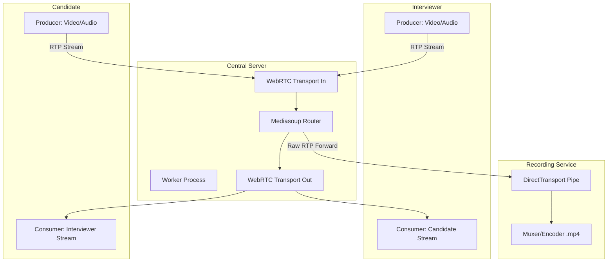
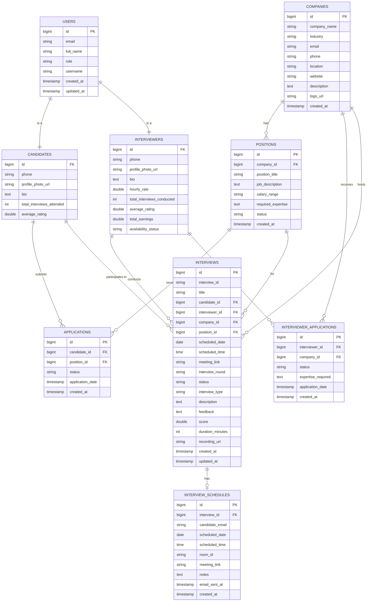
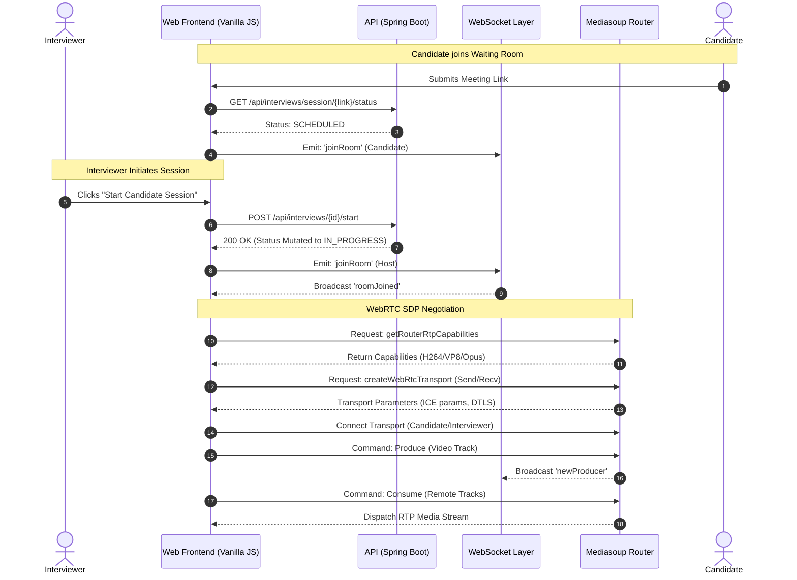

# Project Report
## on
# Online Technical Hiring Platform
### BTech-IT, Sem VI

    

**Prepared By:**
- **[Student 1 Name]** ([IT-RollNo])
- **[Student 2 Name]** ([IT-RollNo])

    

**Guided By:**
**Prof. (Dr.) H. B. Prajapati**
Dept. of Information Technology

      

**Department of Information Technology**
**Faculty of Technology, Dharmsinh Desai University**
**College Road, Nadiad - 387001**
**April, 2024**

## CANDIDATE’S DECLARATION

I/We declare that the 6th-semester report entitled “**Online Technical Hiring Platform (PeerChat)**” is my/our own work conducted under the supervision of the guide **Prof. (Dr.) H. B. Prajapati**.

I/We further declare that to the best of my/our knowledge the report for B.Tech. VI semester does not contain part of the work which has been submitted either in this or any other university without proper citation.

   

___________________________
**Candidate’s Signature**
**[Student 1 Name]**
Student ID: [ID 1]

  

___________________________
**Candidate’s Signature**
**[Student 2 Name]**
Student ID: [ID 2]

## DHARMSINH DESAI UNIVERSITY
### NADIAD-387001, GUJARAT

  

## CERTIFICATE

This is to certify that the project carried out in the subject of Project-I, entitled “**Online Technical Hiring Platform (PeerChat)**” and recorded in this report is a bonafide report of work of:

1) **[Student 1 Name]** Roll No. **[Roll 1]** ID No: **[ID 1]**
2) **[Student 2 Name]** Roll No. **[Roll 2]** ID No: **[ID 2]**

of Department of Information Technology, semester VI. He/She/They was/were involved in Project work during the academic year 2023-2024.

    

___________________________
**Prof. (Dr.) H. B. Prajapati**
(Project Guide),
Department of Information Technology,
Faculty of Technology,
Dharmsinh Desai University, Nadiad
Date:

    

___________________________
**Prof. (Dr.) V. K. Dabhi**
Head, Department of Information Technology,
Faculty of Technology,
Dharmsinh Desai University, Nadiad
Date:

## ACKNOWLEDGEMENT

The success and final outcome of this project required a lot of guidance and assistance from many people, and we are extremely privileged to have got this all along the completion of our project. All that we have done is only due to such supervision and assistance, and we would not forget to thank them.

We respect and thank our guide, **Prof. (Dr.) H. B. Prajapati**, for providing us an opportunity to do the project work in the university domain and giving us all support and guidance which made us complete the project duly. Throughout the project development period, he provided crucial insights into advanced WebRTC architectures and guided the implementation towards an enterprise-grade standard.

We are thankful to and fortunate enough to get constant encouragement, support, and guidance from all the teaching and non-teaching staff of the Department of Information Technology, Dharmsinh Desai University, which helped us in successfully completing our project work.

   

- **[Student 1 Name]**
- **[Student 2 Name]**

## ABSTRACT

The rapid shift toward remote work has fundamentally transformed talent acquisition, necessitating specialized tools for technical assessments. The "Online Technical Hiring Platform (PeerChat)" addresses the fragmentation and inefficiency of current hiring workflows by consolidating communication, scheduling, queue management, and session auditing into a unified, high-performance web application. 

This project engineers a sophisticated real-time communication platform utilizing a Selective Forwarding Unit (SFU) architecture powered by Mediasoup and WebRTC. Unlike traditional peer-to-peer (Mesh) or Multipoint Control Unit (MCU) topologies, the SFU approach intelligently routes media packets rather than mixing them. This methodology drastically reduces client-side CPU consumption and bandwidth requirements, enabling highly scalable multiparty interviewing environments.

Complementing the real-time media layer, the platform features a robust backend developed in Java Spring Boot, leveraging PostgreSQL for relational data persistence. The system implements secure, role-based access control (RBAC), distinguishing dynamically between candidate and interviewer operational scopes. Furthermore, server-side recording capabilities are integrated seamlessly via FFmpeg, ensuring that technical evaluations are securely preserved for asynchronous review.

The deployment architecture utilizes Amazon Web Services (AWS) EC2, managed through an automated continuous integration and continuous deployment (CI/CD) pipeline via GitHub Actions. By streamlining real-time signaling, dynamic queue states, and resilient deployment protocols, PeerChat represents a comprehensive, enterprise-ready technical hiring solution.

## TABLE OF CONTENTS

| Title | Page No |
| :--- | :--- |
| **ABSTRACT** | **v** |
| **LIST OF FIGURES** | **vii** |
| **LIST OF TABLES** | **viii** |
| **ABBREVIATIONS** | **ix** |
| **CHAPTER-1: INTRODUCTION** | **1** |
| 1.1 Project Details | 1 |
| 1.2 Purpose | 1 |
| 1.3 Scope | 2 |
| 1.4 Objective | 2 |
| 1.5 Technology and Literature Review | 3 |
| **CHAPTER-2: PROJECT MANAGEMENT** | **4** |
| 2.1 Feasibility Study | 4 |
| 2.2 Project Planning | 5 |
| 2.3 Project Development Approach and Justification | 5 |
| 2.4 Roles and Responsibilities | 6 |
| **CHAPTER-3: SYSTEM REQUIREMENTS STUDY** | **7** |
| 3.1 Study of Current System | 7 |
| 3.2 Problems and Weaknesses of Current System | 7 |
| 3.3 User Characteristics | 7 |
| 3.4 Hardware and Software Requirements | 8 |
| 3.5 Constraints | 8 |
| **CHAPTER-4: SYSTEM ANALYSIS & DESIGN** | **9** |
| 4.1 Requirements of New System (SRS) | 9 |
| 4.2 System Architecture Design | 10 |
| 4.3 Database and Data Structure Design | 12 |
| 4.4 Unified Modeling Language (UML) Diagrams | 14 |
| **CHAPTER-5: IMPLEMENTATION PLANNING** | **17** |
| 5.1 Implementation Environment | 17 |
| 5.2 Program and Module Specifications | 17 |
| **CHAPTER-6: TESTING** | **19** |
| 6.1 Testing Plan | 19 |
| 6.2 Testing Methods | 19 |
| **CHAPTER-7: CONCLUSION AND DISCUSSION** | **20** |
| 7.1 Conclusion | 20 |
| 7.2 Problems Encountered and Possible Solutions | 20 |
| 7.3 Limitation and Future Enhancement | 21 |
| **REFERENCES** | **22** |

## CHAPTER-1: INTRODUCTION

### 1.1 Project Details
The "Online Technical Hiring Platform (PeerChat)" is an advanced, real-time video interviewing ecosystem engineered to streamline remote technical assessments. The platform integrates a modern web interface with a robust backend infrastructure, utilizing Mediasoup as a Selective Forwarding Unit (SFU) alongside WebRTC technology. This architecture guarantees low-latency, scalable peer-to-peer communication, featuring high-fidelity video/audio transmission, automated session recording, and seamless CI/CD capabilities for cloud deployment on AWS.

The project is structured as a comprehensive distributed system, separating concerns across a dynamic Vanilla JavaScript/HTML frontend, a highly optimized Node.js real-time media server, and a stateful Java Spring Boot RESTful API layer.

### 1.2 Purpose
The primary purpose of this platform is to provide a unified, friction-less environment for organizations to execute technical interviews. By consolidating queue management, real-time communication, and automated session recording into a single cohesive application, the platform eliminates the need for disparate third-party tools. 

Currently, technical hiring involves scheduling on one platform, hosting the video on another, and manually recording interactions, which leads to fractured data states. PeerChat centralizes these operations, significantly enhancing the operational efficiency for interviewers and standardizing the digital footprint of the candidate evaluation process.

### 1.3 Scope
The current iteration of the system is strictly scoped to the critical path of the technical interview lifecycle. It encompasses the following operational domains:
- **Comprehensive User Management**: Secure authentication, authorization, and role-based access control (RBAC) utilizing JSON Web Tokens (JWT), strictly distinguishing between `CANDIDATE` and `INTERVIEWER` profiles.
- **Dynamic Interview Lifecycle Management**: Full CRUD operations governing the scheduling of interviews, paired with a real-time queue management system that dictates state transitions (e.g., Scheduled, In-Progress, Completed) synchronously across active clients.
- **Enterprise Communication Infrastructure**: Multiparty video and audio conferencing powered by a highly optimized Mediasoup SFU implementation over UDP transport streams.
- **Media Preservation**: Server-side recording of active sessions utilizing a specialized `DirectTransport` pathway feeding RTP packets into an FFmpeg encoder process.

### 1.4 Objective
The core objectives guiding the architectural design and functional delivery of the project include:
1. To architect and deploy a scalable WebRTC application capable of sustaining concurrent multi-party video streams without inducing catastrophic client-side latency.
2. To implement an efficient SFU routing mechanism that drastically reduces client-side bandwidth and CPU overhead compared to traditional Mesh topologies.
3. To engineer a robust, state-managed waiting room and queue architecture facilitating seamless back-to-back interview continuity for human resource departments.
4. To establish a CI/CD cloud deployment methodology on Amazon Web Services (AWS) that dynamically handles IP allocation protocols for Mediasoup announcement payloads.

### 1.5 Technology and Literature Review
A comprehensive technology stack was selected to balance rapid iterative frontend development with enterprise-grade backend stability and high-performance media routing:
- **Frontend Presentation Layer**: Vanilla JavaScript (ES6+), HTML5, and standard CSS3 (avoiding heavy framework overhead for optimized media rendering).
- **Backend Services Layer (API)**: Java Spring Boot leveraging Hibernate (JOINED inheritance strategy) for Object-Relational Mapping (ORM) and PostgreSQL for persistent relational data storage.
- **Real-Time Media Layer**: Node.js utilizing Mediasoup (for SFU routing), `mediasoup-client` (for device abstraction), and Socket.io (for WebSocket signaling over TCP).
- **Media Processing**: Server-side Real-time Transport Protocol (RTP) packet consumption via native FFmpeg execution for `.mp4` and `.webm` generation.
- **Cloud Infrastructure & DevOps**: Amazon Web Services (AWS EC2 - Ubuntu Server), integrating custom bash scripts for dynamic IP resolution, paired with GitHub Actions driving the CI/CD pipeline.

## CHAPTER-2: PROJECT MANAGEMENT

### 2.1 Feasibility Study
Before initiating the core development loop, an extensive feasibility study was conducted to ensure the project’s viability across technical, scheduling, and operational dimensions.

#### 2.1.1 Technical Feasibility
The integration of established, industry-standard technologies (Vanilla JS, Spring Boot) ensures a high degree of foundational stability. The critical technical risk involved the real-time media layer. Thorough prototyping validated that the strategic selection of an SFU architecture (Mediasoup) over a strict peer-to-peer Mesh topology critically validates the platform's capacity to scale dynamically. The SFU model avoids catastrophic CPU burn on client devices during multi-party calls by offloading the routing complexity to the EC2 server instance.

#### 2.1.2 Time Schedule Feasibility
The project scope was managed via strict modular decoupling. The monolithic separation of the `platform-frontend`, `platform-backend`, and `media-server` repositories allowed development parallelization. The REST API schemas and Database ERDs were finalized in Sprint 1, paving the way for decoupled frontend development against mock endpoints while the backend logic was authored. This approach guaranteed completion within the academic semester.

#### 2.1.3 Operational Feasibility
The platform design strictly mandates a zero-installation policy for clients. The application operates entirely via modern HTML5-compliant web browsers leveraging native `navigator.mediaDevices` APIs. This frictionless accessibility ensures complete operational viability across varying user technical proficiencies and operating systems (Windows, macOS, Linux).

#### 2.1.4 Implementation Feasibility
Deployment risks were mitigated early by standardizing the AWS EC2 environment. The incorporation of automated deployment shell scripts, dynamic public IP detection specifically for the WebRTC NAT traversal requirements, and a fully functional CI/CD pipeline mathematically reduces deployment overhead, ensuring iterative updates are risk-averse and highly feasible.

### 2.2 Project Planning
The project was structured across three primary evolutionary phases:
1. **Foundation & Data Modeling**: Establishing the PostgreSQL schema, building the Java Spring Boot REST controllers, and securing the authentication endpoints.
2. **Real-Time Signaling Core**: Constructing the Node.js Mediasoup worker instances, establishing WebRTC device transports, and enabling producer/consumer RTP streaming.
3. **Integration & Orchestration**: Binding the native Web API frontend to the REST API for static data and the WebSocket server for dynamic event signaling (e.g., active queue updates, video track instantiation).

### 2.3 Project Development Approach and Justification
An Agile iterative methodology was employed. Given the high complexity of the WebRTC stack, a traditional "Waterfall" model posed tremendous risk; discovering architectural flaws in the signaling layer late in development would be fatal. Agile allowed for intermediate "proof of concept" checkpoints—such as verifying basic local loopback video before attempting server-side routing, and verifying server routing before attempting FFmpeg recording integrations.

## CHAPTER-3: SYSTEM REQUIREMENTS STUDY

### 3.1 Study of Current System
The existing paradigm of remote technical hiring is predominantly executed through a fragmented aggregation of independent Software-as-a-Service (SaaS) products. A typical organizational workflow mandates context switching across scheduling platforms (e.g., Calendly), generalized video conferencing software (e.g., Zoom, Google Meet, Microsoft Teams), isolated code assessment sandboxes, and manual local file management for recording retention.

### 3.2 Problems and Weaknesses of Current System
- **Severe Cognitive Overhead**: Interviewers must actively manage links, invites, and contextual context across varying platforms, leading to operational fatigue.
- **Absence of Synchronized State**: Disconnected tools offer no native "waiting room" queue management tailored for back-to-back technical interviewing cadences. You cannot seamlessly pull the "next candidate" from a generalized Zoom meeting without manual link distribution.
- **Proprietary Ecosystem Lock-in**: Deep integration into custom enterprise HR portals is heavily restricted or financially prohibitive when relying on commercial teleconferencing vendors.

### 3.3 User Characteristics
The system targets two distinct user archetypes, optimized for their specific requirements:
- **Interviewers**: Technical evaluators demanding a stable, high-performance medium. They hold the "Host" state, requiring elevated administrative privileges to initiate sessions, control the candidate queue flow, dictate recording status, and review the candidates' uploaded profiles (Skills, Resume URLs).
- **Candidates**: Job applicants seeking a highly streamlined entry process. Candidates require zero-configuration access—a simple authenticated hyperlink that bypasses cumbersome profile configurations and drops them directly into a pre-established WebRTC peer connection waiting room.

### 3.4 Hardware and Software Requirements

**Server-Side Environment:**
- **Compute Instance**: Amazon Web Services (AWS) EC2 `t3.small` or `t3.medium` virtualization (burst capable).
- **Storage Profile**: Minimum 50GB General Purpose SSD (gp2/gp3) to facilitate buffer loads for concurrent video `.mp4` generation.
- **Operating System**: Ubuntu 24.04 LTS (Long Term Support).
- **Runtime Dependencies**: Node.js (v18+), Java SE Runtime Environment (JRE 17+), PostgreSQL 15+, and FFmpeg libraries.

**Client-Side Environment:**
- **Software**: Modern HTML5 compliant Web Browser featuring WebRTC standards adherence (Google Chrome V80+, Mozilla Firefox V75+, Apple Safari V13+).
- **Hardware**: Active and accessible Web Camera and Microphone peripherals, compliant with local OS privacy configurations.

### 3.5 Constraints

#### 3.5.1 Network Security Constraints (NAT/Firewalls)
WebRTC relies heavily on UDP transport for real-time latency minimization. The system is constrained by strict corporate firewalls that block outbound UDP traffic. To mitigate this, specific AWS Security Group Inbound rules are required (Ports `40000 - 40050`).

#### 3.5.2 Parallel Operations (Concurrency Scaling)
While the SFU architecture is vastly superior to a Mesh network, the Node.js worker instance responsible for Mediasoup packet routing is strictly single-threaded per worker core. The platform must strategically spawn Mediasoup workers commensurate with the EC2 instance's logical CPU cores to avoid catastrophic bottlenecks during peak parallel interview schedules.

## CHAPTER-4: SYSTEM ANALYSIS & DESIGN

### 4.1 Requirements of New System (SRS)

**Functional Requirements:**
1. **Authentication Matrix**: The system must securely register and authenticate users via encrypted JWT payloads, distinctly parsing properties unique to the `CANDIDATE` entity (resume URLs) versus the `INTERVIEWER` entity (company associations).
2. **State Machine Integrity**: The application must enforce strict validation protocols preventing overlapping schedule states, and programmatically handling the `SCHEDULED` → `IN_PROGRESS` → `COMPLETED` lifecycle in the PostgreSQL database.
3. **Optimized Media Routing**: The SFU component must dynamically establish Send and Receive transports, negotiating Media SDP (Session Description Protocol) payloads independently for Audio and Video tracks.
4. **Resilient Recording Architecture**: The backend must spawn dedicated FFmpeg child processes to consume raw RTP feeds, muxing them efficiently to avoid CPU locking on the primary Node event thread.

**Non-Functional Requirements:**
- **Latency Optimization**: Sub-300ms glass-to-glass latency for real-time video interaction.
- **Fault Tolerance**: Dynamic recovery of Mediasoup Producer states if a WebSocket TCP connection briefly drops and reconnects (e.g., mobile network handoffs).

### 4.2 System Architecture Design
The core architectural philosophy is predicated upon the Selective Forwarding Unit (SFU) pattern.

**Why SFU vs. Mesh?**
In a traditional Peer-to-Peer (Mesh) call with *N* participants, every user must encode and upload their video stream *(N-1)* times, and download *(N-1)* streams. For a 4-person interview, a candidate is uploading 3 distinct HD video streams, entirely saturating consumer-grade upload bandwidth and critically spiking their CPU.

In the PeerChat SFU paradigm, the Candidate uploads their stream exactly **once** to the Server (EC2). The Mediasoup router residing on the server then cheaply *duplicates* and *routes* those packets to the other 3 viewers. 

This establishes a Star Topology where the server acts as the central routing nexus, absorbing the bandwidth penalty.

*Fig 4.1 SFU Mediasoup Routing Architecture*

### 4.3 Database and Data Structure Design
To ensure robust relational data modeling and enforce domain-level object orientation, the Java Spring Boot backend implements Hibernate's `JOINED` mapping strategy.

Instead of a single monolithic table, the system utilizes an extensive, normalized schema extending beyond base users to incorporate complete B2B hiring flows.

**Core Entities & Relationships (V1 & V2 Features):**
- **Users**: Base authenticated entity.
- **Candidates / Interviewers**: Inherits from Users, containing role-specific metadata (Skills/Experience vs. Hourly Rates/Expertise).
- **Companies**: Organizational entities hosting `Positions`.
- **Positions**: Job openings tied to standard `Skills`.
- **Applications**: Join table mapping `Candidates` to `Positions`.
- **Interviews**: The core transaction, tying a `Candidate`, `Interviewer`, `Company`, and `Position` to a specific WebRTC Session (`meeting_link`).

*Fig 4.2 Database Entity Relationship Model*

### 4.4 Unified Modeling Language (UML) Diagrams

#### Sequence Diagram: The Interview Lifecycle Negotiation
This sequence accurately maps the complex asynchronous events triggered when an interviewer initiates an active evaluation. It outlines the hybrid approach: utilizing REST for static database mutations and WebSockets for real-time signaling.

*Fig 4.3 Sequence Diagram of Interview Call Negotiation*

## CHAPTER-5: IMPLEMENTATION PLANNING

### 5.1 Implementation Environment

**Cloud Hosting Specifications:**
The deployment strategy leverages Amazon EC2 instances to gain comprehensive network and computational control—an absolute necessity when compiling and running native low-level C++ binaries required by Mediasoup and FFmpeg.

**Network Routing Constraints (AWS Security Groups):**
Detailed port mapping guarantees that standard web traffic interfaces cleanly with complex UDP media streams.
- **TCP Port 22**: Restricted Secure Shell (SSH) access for deployment administrators.
- **TCP Port 3000**: General ingress point for the Node.js server, which parses static HTTP requests (serving standard HTML/JS files via Express) and upgrades persistent connections to WebSockets.
- **TCP Port 8080**: Discretely mapped to the Java Spring Tomcat container, processing robust JDBC and JWT validation functions.
- **UDP Ports 40000 - 40050**: The critical inbound rule permitting WebRTC Ice Candidate resolution. Without this permissive blanket, ICE negotiation fails, resulting in black screens over cellular networks.

### 5.2 Program and Module Specifications

**Module 1: Authentication and Data Federation (Spring Boot Context)**
This module functions as the strict gatekeeper of state, utilizing **JWT Bearer Token Authentication**. 
- It employs a `OncePerRequestFilter` to intercept all inward traffic.
- Validates the Authorization header using an HMAC-SHA256 (HS256) signature. 
- Distributes highly segregated API access (e.g., `/api/candidates`, `/api/companies`, `/api/applications`) based on Extracted Authorities (`ROLE_CANDIDATE`, `ROLE_INTERVIEWER`).

**Core REST Components (API Surface):**
The API is fundamentally completely normalized to support a full marketplace approach:
- **Authentication**: `/api/auth/login` and `/api/auth/signup` for JWT issuance.
- **Enterprise Management**: `/api/companies` and `/api/positions` facilitating B2B job postings.
- **Application Processing**: `/api/applications` mapping Candidates to Positions with tracked states (`APPLIED`, `SHORTLISTED`, `OFFERED`).
- **Interview Coordination**: `/api/interviews/schedule` to generate the unique `meeting_link` and room bindings.

**Module 2: Real-Time Signaling Plane (Socket.io Layer)**
This Node.js component abstracts the complexity of bidirectional communications. Rather than polling the database to ascertain if an interviewer is ready, the system utilizes active push topologies. When the status Mutates, the WebSocket server aggressively broadcasts the `updateStatus` event to all clients actively subscribed to a discrete `meetingLink` room payload.

**Module 3: Synchronous Media Engine (Mediasoup WebWorker)**
Mediasoup abstracts complex WebRTC configurations into high-level constructs.
- **Router**: The central component corresponding logically to a "Room". It comprehends RTP capabilities (codecs supported).
- **Transport**: Represents the endpoint negotiation. Due to strict NAT traversal requirements, the server explicitly defines its public-facing IP allocation via the dynamically injected `MEDIASOUP_ANNOUNCED_IP` environment variable during the `createWebRtcTransport` initialization phase.

## CHAPTER-6: TESTING

### 6.1 Testing Plan
A rigorous testing framework was deployed to validate both standard logic flow and the resilient handling of edge-case network scenarios. Testing was sequenced across Unit validations of API end points, progressing to complex systemic integration tests tracing the entire WebRTC handshake protocol.

### 6.2 Testing Methods

**Method 1: API Endpoint Validation (Postman Suites)**
- Test isolation aimed to rapidly ascertain the integrity of the JWT token generation logic. Assertions verified that utilizing an expired or structurally manipulated token generated an accurate `401 Unauthorized` response code preventing unauthorized SQL injections.
- Validated state mutations on the POST /start endpoint, asserting that simultaneous API calls did not trigger race condition state regressions inside the database table mapping.

**Method 2: Multi-Browser Integration Testing**
To guarantee interoperability regarding video encoding definitions (e.g., Apple Safari severely restricting VP8 codec usage compared to Google Chrome), cross-browser matrices were heavily tested. Tests verified that Mediasoup accurately negotiated unified codec baselines (such as H264 hardware encoding availability) ensuring consistent stream replication across differing platforms.

**Method 3: Infrastructure and Telemetry Resilience Processing**
During the cloud deployment cycle, tests were instituted against the continuous availability of dynamic IP interfaces.
- **Testing Condition**: Simulation of AWS instance reboot sequence.
- **Expected Result**: System executes the bash payload `. ./init_data.sh`, effectively curling local AWS metadata interfaces (via `curl ifconfig.me`), injecting the newly provisioned IP block into the Mediasoup worker configuration without manual intervention.
- **Outcome**: The server successfully broadcasted its accurate dynamic IP, successfully binding transports locally without causing silent failure states.

## CHAPTER-7: CONCLUSION AND DISCUSSION

### 7.1 Conclusion
The "Online Technical Hiring Platform (PeerChat)" successfully amalgamates classical, stateful RESTful business logic and database persistence schemas with an actively dynamic, high-performance real-time media transport layer. By executing a sophisticated Selective Forwarding Unit (SFU) from the ground up utilizing Mediasoup, the system tangibly demonstrates the vast superiority and computational efficiency of targeted UDP packet routing over legacy peer-to-peer mesh networking paradigms, specifically in multi-party streaming contexts.

The unified integration of the scheduling pipeline, the real-time execution environment, and server-side media archiving provides a formidable solution to the highly fragmented technical hiring space. The CI/CD deployment execution on AWS solidifies the project not just as a proof-of-concept, but as an enterprise-scalable utility.

### 7.2 Problems Encountered and Possible Solutions

**Problem 1: Ubiquitous AWS UDP Ingress Filtering**
*Description*: Initial cross-network media streaming attempts (Mobile LTE routing to AWS) failed silently, stalling perpetually on ICE gathering phases.
*Solution*: Rigorous trace analysis uncovered AWS security group inbound restrictions dynamically dropping UDP packets. Corrective action required explicit modification of the EC2 Security Group to whitelist the specific subset `40000-40050` UDP block, instantly restoring stream integrity.

**Problem 2: Volatile Cloud Topology Binding Restrictions**
*Description*: Standard virtual machine deployments actively cycle private IP schemas upon systemic reboot. Mediasoup requires a statically announced IP flag to complete DTLS handshakes; rebooting caused instance failures.
*Solution*: Engineered a dynamic initialization shell protocol via `DETECT_PUBLIC_IP=true`. This architecture natively intercepts boot sequences, queries external metadata hubs to map the external interfaces dynamically, and seamlessly injects the correct parameters into Mediasoup.

**Problem 3: FFmpeg Synchronization Drifting Mechanisms**
*Description*: Early testing of the `DirectTransport` layer exposed extreme transcription desyncing, yielding final video files with severe offsets in audio and visual framing timestamps.
*Solution*: Re-architected the RTP consumer pipeline definitions within the Node backend to rigorously parse RTP header extension sequences. This guaranteed timestamp sequencing fidelity before directly piping byte arrays to the isolated secondary transcoder process.

**Problem 4: Serverless Deployment Incompatibilities (Why Not Vercel?)**
*Description*: Early architectural planning considered deploying the Node.js backend to serverless platforms like Vercel or Platform-as-a-Service (PaaS) providers like Heroku to minimize DevOps overhead. However, technical analysis proved this impossible.
*Solution*: A hard pivot to AWS EC2 was required due to three fundamental constraints of serverless/Vercel architecture:
1. **Lack of UDP Support:** Mediasoup relies entirely on User Datagram Protocol (UDP) ports (`40000-40050`) for low-latency WebRTC media routing. Serverless functions (like Vercel Edge/Lambdas) exclusively route HTTP/HTTPS (TCP) traffic and actively drop UDP packets.
2. **WebSocket Timeouts:** Real-time signaling requires persistent, long-lived bidirectional TCP WebSocket connections. Serverless functions are ephemeral, typically timing out and dying after 10 to 60 seconds of execution, instantly terminating active interview signals.
3. **C++ Binary Execution:** Mediasoup and FFmpeg require compiling and executing complex, stateful native C++ libraries at runtime. Serverless execution environments do not allow running heavy background system processes or persistently mapping raw audio/video buffer processing.

### 7.3 Limitation and Future Enhancement

**Immediate Limitations:**
The immediate constraint involves the vertical scalability of the server architecture. Currently, Mediasoup workers are tightly coupled with the host CPU compute capabilities. Distributing the `interviews` mapping across horizontally scaled instances sitting behind an application load balancer represents a high-priority refinement necessary for scaling beyond isolated stress testing bounds.

**Proposed Future Enhancements:**
1. **Interactive Collaborative IDE Sandbox**: Ingesting a complex, real-time code execution environment (leveraging Docker containerization) seamlessly integrated into the primary viewport. Evaluators will have the capacity to supply runtime criteria to execute code comprehensively adjacent to the video tracking feed.
2. **AI-Driven Linguistic Compilation Models**: Post-processing the isolated audio channels dynamically through neural network translation models to rapidly establish candidate sentiment analysis and core-competency summation matrices.
3. **Discrete Screen-Share Multiplexing**: Expanding the Mediasoup consumer routing matrix to natively differentiate, flag, and transmit full-fidelity screen-sharing captures concurrently alongside the standard subjective webcam transmission paths. 

## REFERENCES

[1] Mediasoup Documentation Core Team (2024). *Mediasoup SFU Architecture Official Guidelines Version 3.1x*. Retrieved from mediasoup.org.

[2] Bauer, M. (2023). *Advanced WebRTC Topologies: SFU vs Mesh vs MCU*. Manning Publications, New York.

[3] Spring Framework Contributors (2024). *Spring Security OAuth 2.0 and JWT Integration Patterns*. VMware, Inc.

[4] FFmpeg Developers (2024). *FFmpeg Encoding Documentation for Direct Media Streaming*. ffmpeg.org.

[5] Amazon Web Services Technical Library (2023). *Optimizing EC2 Networking Topologies for High Throughput UDP WebRTC Applications*. AWS Documentation.

[6] Dabhi, V. K., Prajapati, H. B. (2024). *Internal Departmental Guidelines for Formatting and Presenting Project Phase 1 Architecture Proposals*. Faculty of Technology, Dharmsinh Desai University, Nadiad.
