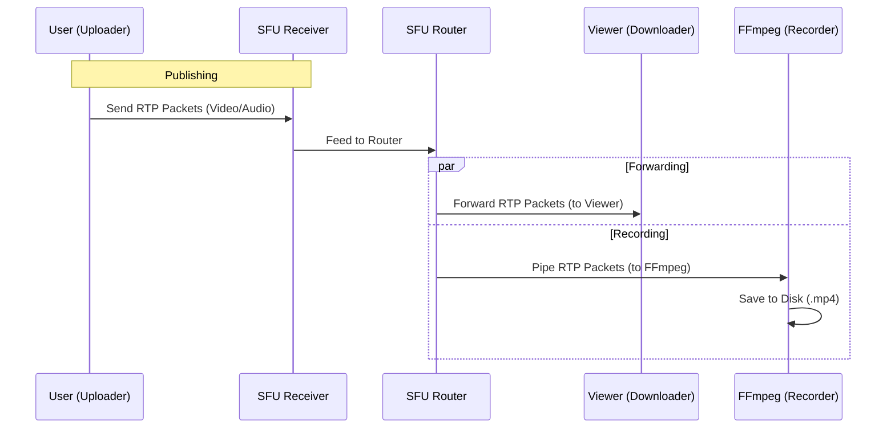

# Online Technical Hiring Platform

A comprehensive hiring ecosystem with real-time video interviewing, built with Spring Boot, React, Mediasoup (SFU), and WebRTC. Features support for company management, job positions, candidate applications, interviewer hiring, and screen recording.

## Features

### 🏢 Complete Hiring Ecosystem
- **Company Management**: Companies can create profiles and post job positions
- **Position Management**: Create and manage job openings with detailed requirements
- **Candidate Applications**: Candidates can apply to positions and track application status
- **Interviewer Hiring**: Companies can hire interviewers with specific expertise
- **Interview Scheduling**: Schedule interviews linked to positions and companies

### 🎥 Real-Time Video Interviews
- **High Quality Video/Audio**: Uses Mediasoup SFU for scalable multiparty conferencing
- **Screen Recording**: Server-side recording of video and audio sessions
- **Email Notifications**: Automated interview invitations and reminders
- **Dynamic IP Support**: Automatically detects public IP on AWS (EC2) for seamless connectivity

### 👥 User Profiles
- **Candidates**: Skills, resume, bio, ratings, interview history
- **Interviewers**: Expertise, hourly rate, earnings, availability status, ratings

## Architecture

### Database Schema (9 Tables)
- `users` - Base authentication and user data
- `candidates` - Extended candidate profiles
- `interviewers` - Extended interviewer profiles
- `companies` - Company profiles
- `positions` - Job positions
- `applications` - Candidate job applications
- `interviewer_applications` - Interviewer hiring applications
- `interviews` - Interview sessions
- `interview_schedules` - Interview scheduling details

See [docs/API_DB_DETAILS.md](docs/API_DB_DETAILS.md) for complete ER diagram and API documentation.

## Quick Start (Local Development)

### Backend (Spring Boot)
1.  **Checkout Backend Branch**:
    ```bash
    git checkout simplification-branch
    ```
2.  **Configure Database**:
    - Update `platform-backend/src/main/resources/application.properties` with your PostgreSQL credentials
    - Set `spring.jpa.hibernate.ddl-auto=update` for the first run
3.  **Run**:
    ```bash
    cd platform-backend
    mvn spring-boot:run
    ```
    - Backend runs on `http://localhost:8080`

### Frontend (React + Vite)
1.  **Install Dependencies**:
    ```bash
    cd platform-frontend
    npm install
    ```
2.  **Start Development Server**:
    ```bash
    npm run dev
    ```
    - Frontend runs on `http://localhost:5173`

### Media Server (Mediasoup)
1.  **Install Dependencies**:
    ```bash
    cd media-server
    npm install
    ```
2.  **Start Server**:
    ```bash
    npm start
    ```
    - Media server runs on `http://localhost:3000`

## API Endpoints

### Authentication
- `POST /api/auth/signup` - Register new user (Candidate/Interviewer)
- `POST /api/auth/login` - Login and get JWT token

### Companies
- `POST /api/companies` - Create company
- `GET /api/companies` - Get all companies
- `GET /api/companies/{id}` - Get company by ID
- `PUT /api/companies/{id}` - Update company
- `DELETE /api/companies/{id}` - Delete company

### Positions
- `POST /api/positions` - Create job position
- `GET /api/positions` - Get all positions
- `GET /api/positions/open` - Get open positions
- `GET /api/positions/company/{companyId}` - Get positions by company
- `PUT /api/positions/{id}` - Update position
- `DELETE /api/positions/{id}` - Delete position

### Applications
- `POST /api/applications` - Submit application
- `GET /api/applications/candidate/{candidateId}` - Get candidate's applications
- `GET /api/applications/position/{positionId}` - Get position's applications
- `PATCH /api/applications/{id}/status` - Update application status

### Interviewer Applications
- `POST /api/interviewer-applications` - Submit interviewer application
- `GET /api/interviewer-applications/interviewer/{interviewerId}` - Get interviewer's applications
- `GET /api/interviewer-applications/company/{companyId}` - Get company's interviewer applications
- `PATCH /api/interviewer-applications/{id}/status` - Update status

### Interviews
- `POST /api/interviews/schedule` - Schedule interview
- `GET /api/interviews/candidate/upcoming` - Get upcoming interviews
- `POST /api/interviews/{id}/start` - Start interview
- `POST /api/interviews/{id}/complete` - Complete interview

## Documentation
- **[API & Database Details](docs/API_DB_DETAILS.md)**: Complete ER diagram, schema, and API reference
- **[Integration Guide](docs/INTEGRATION_GUIDE.md)**: Frontend integration steps and workflows
- **[AWS Deployment](AWS_DEPLOYMENT_GUIDE.md)**: Guide to deploying on AWS EC2

## Deployment (AWS)

This project is configured for automated deployment to AWS EC2 (Ubuntu).

### 1. Initial Server Setup

Follow the `AWS_DEPLOYMENT_GUIDE.md` to launch an instance and install dependencies (Node.js, FFmpeg, PostgreSQL, Java).

### 2. Automatic IP Detection

The media server is configured to automatically detect its public IP on startup.

- **Setup**: Ensure `DETECT_PUBLIC_IP=true` is set in the `.env` file on the server.
- **Benefit**: You can stop/start the instance and the server will automatically adapt to the new IP address.

### 3. CI/CD (GitHub Actions)

Changes pushed to the `main` branch are automatically deployed to the AWS server.

**Required GitHub Secrets:**
Go to **Settings** > **Secrets and variables** > **Actions** and add:

- `AWS_HOST`: Private or Public IP of your server (e.g., `13.233.139.200`).
  > **Important**: If you stop/start your AWS instance, this IP will change. To avoid updating this secret constantly, **allocate an Elastic IP (Static IP)** in the AWS Console and associate it with your instance. This gives you a permanent IP address.
- `AWS_USERNAME`: `ubuntu`
- `AWS_SSH_KEY`: Content of your `.pem` key file.
- `TARGET_DIR`: Path to project on server (e.g., `/home/ubuntu/Online-Tech-Hiring-Platform`).

## Environment Variables

### Backend (`application.properties`)
```properties
spring.datasource.url=jdbc:postgresql://localhost:5432/hiring_platform
spring.datasource.username=your_username
spring.datasource.password=your_password
spring.mail.username=your_email@gmail.com
spring.mail.password=your_app_password
jwt.secret=your_jwt_secret
```

### Media Server (`.env`)
| Variable                 | Description                    | Default                        |
| :----------------------- | :----------------------------- | :----------------------------- |
| `PORT`                   | HTTP Server Port               | `3000`                         |
| `MEDIASOUP_MIN_PORT`     | Start of UDP range             | `40000`                        |
| `MEDIASOUP_MAX_PORT`     | End of UDP range               | `40050`                        |
| `MEDIASOUP_ANNOUNCED_IP` | Public IP (Auto-filled on AWS) | `Local LAN IP`                 |
| `DETECT_PUBLIC_IP`       | Enable auto-detection          | `false` (Local) / `true` (AWS) |

## Troubleshooting

- **\"Video Connecting...\"**: Ensure UDP ports `40000-40050` are allowed in AWS Security Groups.
- **Deployment Fails**: Check GitHub Actions logs. Verify `AWS_HOST` matches your current IP.
- **Database Connection**: Ensure PostgreSQL is running and credentials are correct.
- **Email Not Sending**: Verify Gmail app password is configured correctly.

## How the Platform Works

### SFU Architecture (Mediasoup)

The platform uses **Mediasoup** as a Selective Forwarding Unit (SFU). This means the server acts as a smart router for media packets.


#### 1. Forwarding (The "Router")

Instead of mixing audio/video (which is CPU intensive), the SFU simply **forwards** packets.

- **Producer**: A user sends their video stream (RTP packets) to the server.
- **Router**: The server's `Router` component receives these packets.
- **Consumer**: When another user wants to watch, the Router creates a copy of the stream and sends it to that user.
- _Benefit_: The uploader only sends 1 stream, regardless of how many people are watching.

#### 2. Recording (FFmpeg Integration)

Recording is handled by treating the "Recorder" as just another user (Consumer).

1.  **Transport Creation**: The server creates a special `DirectTransport` (no network delay) for recording.
2.  **Consumption**: This transport _consumes_ the video and audio streams from the Router.
3.  **Process**: The RTP packets are piped directly into an **FFmpeg** process running on the server.
4.  **Output**: FFmpeg decodes the packets and muxes them into a single `.mp4` or `.webm` file.



## Tech Stack

- **Backend**: Spring Boot 3.4.1, Spring Security, JWT, JPA/Hibernate
- **Database**: PostgreSQL 18
- **Frontend**: React 18, Vite, React Router
- **Media Server**: Node.js, Mediasoup, FFmpeg
- **Real-time**: WebRTC, Socket.io
- **Deployment**: AWS EC2, GitHub Actions
