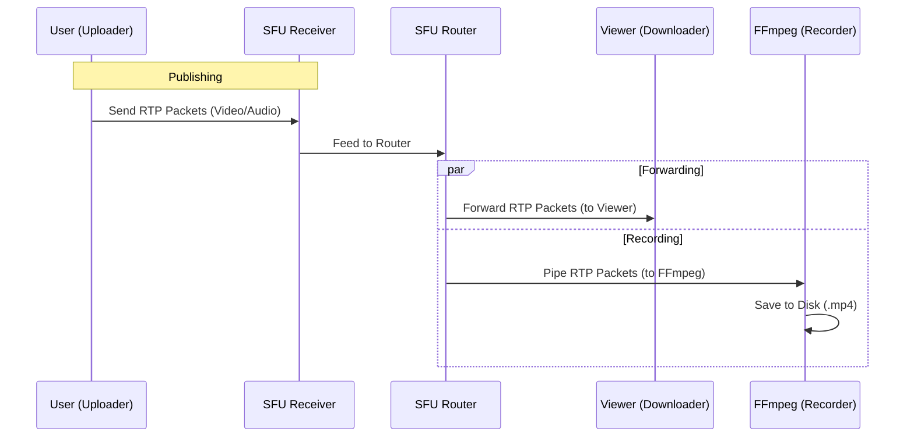

# Online Technical Hiring Platform (PeerChat)

A real-time video interviewing platform built with Mediasoup (SFU) and WebRTC. Features support for screen recording and low-latency peer-to-peer communication.

## Features

- **High Quality Video/Audio**: Uses Mediasoup SFU for scalable multiparty conferencing.
- **Screen Recording**: Server-side recording of video and audio sessions.
- **Dynamic IP Support**: Automatically detects public IP on AWS (EC2) for seamless connectivity.
- **CI/CD Pipeline**: Automated deployment to AWS via GitHub Actions.

## Quick Start (Local Development)

1.  **Install Dependencies**:

    ```bash
    npm install
    ```

2.  **Start Server**:

    ```bash
    npm start
    ```

    - Access at `http://localhost:3000`.

## Deployment (AWS)

This project is configured for automated deployment to AWS EC2 (Ubuntu).

### 1. Initial Server Setup

Follow the `AWS_DEPLOYMENT_GUIDE.md` to launch an instance and install dependencies (Node.js, FFmpeg).

### 2. Automatic IP Detection

The server is configured to automatically detect its public IP on startup.

- **Setup**: Ensure `DETECT_PUBLIC_IP=true` is set in the `.env` file on the server.
- **Benefit**: You can stop/start the instance and the server will automatically adapt to the new IP address.

### 3. CI/CD (GitHub Actions)

Changes pushed to the `main` branch are automatically deployed to the AWS server.

**Required GitHub Secrets:**
Go to **Settings** > **Secrets and variables** > **Actions** and add:

- `AWS_HOST`: Private or Public IP of your server (e.g., `13.233.139.200`).
  > **Important**: If you stop/start your AWS instance, this IP will change. To avoid updating this secret constantly, **allocate an Elastic IP (Static IP)** in the AWS Console and associate it with your instance. This gives you a permanent IP address.
- `AWS_USERNAME`: `ubuntu`
- `AWS_SSH_KEY`: Content of your `.pem` key file.
- `TARGET_DIR`: Path to project on server (e.g., `/home/ubuntu/Peer-Chat-App`).

## Environment Variables (`.env`)

| Variable                 | Description                    | Default                        |
| :----------------------- | :----------------------------- | :----------------------------- |
| `PORT`                   | HTTP Server Port               | `3000`                         |
| `MEDIASOUP_MIN_PORT`     | Start of UDP range             | `40000`                        |
| `MEDIASOUP_MAX_PORT`     | End of UDP range               | `40050`                        |
| `MEDIASOUP_ANNOUNCED_IP` | Public IP (Auto-filled on AWS) | `Local LAN IP`                 |
| `DETECT_PUBLIC_IP`       | Enable auto-detection          | `false` (Local) / `true` (AWS) |

## Troubleshooting

- **"Video Connecting..."**: Ensure UDP ports `40000-40050` are allowed in AWS Security Groups.
- **Deployment Fails**: Check GitHub Actions logs. Verify `AWS_HOST` matches your current IP.

## How PeerChat Works (SFU Architecture)

PeerChat uses **Mediasoup** as a Selective Forwarding Unit (SFU). This means the server acts as a smart router for media packets.


### 1. Forwarding (The "Router")

Instead of mixing audio/video (which is CPU intensive), the SFU simple **forwards** packets.

- **Producer**: A user sends their video stream (RTP packets) to the server.
- **Router**: The server's `Router` component receives these packets.
- **Consumer**: When another user wants to watch, the Router creates a copy of the stream and sends it to that user.
- _Benefit_: The uploader only sends 1 stream, regardless of how many people are watching.

### 2. Recording (FFmpeg Integration)

Recording is handled by treating the "Recorder" as just another user (Consumer).

1.  **Transport Creation**: The server creates a special `DirectTransport` (no network delay) for recording.
2.  **Consumption**: This transport _consumes_ the video and audio streams from the Router.
3.  **Process**: The RTP packets are piped directly into an **FFmpeg** process running on the server.
4.  **Output**: FFmpeg decodes the packets and muxes them into a single `.mp4` or `.webm` file.


