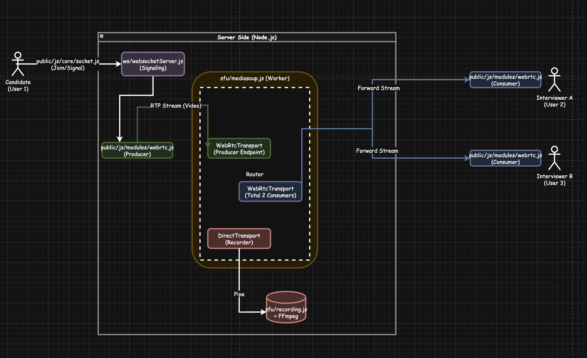

# Online Technical Hiring Platform (PeerChat)

A comprehensive real-time video interviewing and technical hiring platform built as a monorepo. It features scalable role-based user management, structured candidate queues, and a robust low-latency peer-to-peer video conferencing solution using Mediasoup.

---

## Table of Contents
1. [Project Title & Description](#online-technical-hiring-platform-peerchat)
2. [Features](#features)
3. [Demo](#demo)
4. [Installation](#installation)
5. [Usage](#usage)
6. [Project Structure](#project-structure)
7. [Configuration / Environment Variables](#configuration--environment-variables)
8. [API Endpoints](#api-endpoints)
9. [Screenshots](#screenshots)
10. [Contributing Guidelines](#contributing-guidelines)
11. [Contact / Author Info](#contact--author-info)

---

## Features

- **Role-Based Portals**: Dedicated dashboards for *Candidates*, *Interviewers*, and *Company Admins* to streamline the hiring process.
- **Comprehensive Hiring Management**: Tools for scheduling interviews, managing job postings, and tracking candidate progress throughout the pipeline.
- **Real-Time Video Interviews**: Uses a bespoke Mediasoup SFU setup for high-quality, scalable, low-latency multiparty conferencing.
- **Waiting Rooms & Queues**: Built-in pre-call lobby and queue manager for structured, professional interview flows.
- **Screen Sharing & Server-Side Recording**: Native screen sharing support. The media backend streams RTP packets directly to FFmpeg to generate and securely save `.mp4`/`.webm` recordings of the interview.
- **Automated Deployments**: Ready-to-configure CI/CD pipeline via GitHub Actions for AWS EC2 instances, featuring automatic dynamic IP resolution.

---

## Demo

*(Add a link to your live demo, video walkthrough, or staging environment here once deployed)*
- **Live Demo Site**: [https://your-demo-link.com](https://your-demo-link.com)
- **Video Walkthrough**: [YouTube Link](https://youtube.com)

---

## Installation

Follow these step-by-step instructions to set up the monolithic environment locally.

### Prerequisites
- Node.js (v18+)
- Java (v17+) and Maven
- PostgreSQL
- FFmpeg (for server-side video recording)

### 1. Database Setup
Create a PostgreSQL database and configure the local credentials in your Spring Boot application properties before running the backend.

### 2. Backend API (`platform-backend`)
Navigate to the backend directory and start the Spring Boot REST API server:
```bash
cd platform-backend
./mvnw spring-boot:run
```
*(Runs on `http://localhost:8080`)*

### 3. Media Server & SFU (`media-server`)
Install dependencies and run the Node.js Mediasoup server:
```bash
cd media-server
npm install
npm start
```
*(Runs on `http://localhost:3000`)*

### 4. Frontend Application (`platform-frontend`)
Since the frontend uses raw HTML/CSS/JS (or React/Vite depending on your feature branch), serve the static files using a simple web server like Live Server (VS Code), Vite, or configure the `media-server` to serve these files statically from port `3000`.

---

## Usage

1. **Company Admin**: Log in as an admin to create job postings, review scheduled interfaces, and invite candidates/interviewers to the platform.
2. **Candidate**: Apply for jobs through the Candidate portal, view hiring companies, and wait in the lobby when it is time for the scheduled interview.
3. **Interviewer**: Check the Interviewer dashboard for upcoming daily schedules, view candidate resumes, and admit candidates from the waitlist into the main video interview room.
4. **Video Call**: Once an interview starts, both parties can communicate via video and audio. Interviewers can ask technical questions while candidates can utilize screen sharing. The server will seamlessly record the session in the background.

---

## Project Structure

```text
Online-Tech-Hiring-Platform/
├── platform-frontend/       # Web interfaces, dashboards, and interview screen UI
├── platform-backend/        # Spring Boot application (REST APIs, Auth, PostgreSQL)
├── media-server/            # Node.js server for Mediasoup (SFU) & WebRTC recording
├── init_data.sh             # Script to initialize dummy/seed data
├── start_local.sh           # Local bootstrapping scripts
├── .github/workflows/       # CI/CD deployment logic for AWS
└── README.md                # Project documentation
```

---

## Configuration / Environment Variables

### Media Server (`media-server/.env`)
Create a `.env` file in the `media-server` directory with the following variables:
```env
PORT=3000
MEDIASOUP_MIN_PORT=40000
MEDIASOUP_MAX_PORT=40050
DETECT_PUBLIC_IP=false           # Set to true when deploying on AWS EC2
MEDIASOUP_ANNOUNCED_IP=127.0.0.1 # Ensure this matches your local LAN IP
```

### Backend (`platform-backend/src/main/resources/application.properties`)
Update the default properties to match your PostgreSQL setup:
```properties
spring.datasource.url=jdbc:postgresql://localhost:5432/hiring_platform
spring.datasource.username=postgres
spring.datasource.password=your_secure_password
```

---

## API Endpoints

The `platform-backend` provides RESTful access for user, role, and interview management. Below are sample endpoints:

| Method | Endpoint | Description |
|--------|----------|-------------|
| `POST` | `/api/auth/login` | Authenticate users (Admin, Interviewer, Candidate). |
| `GET`  | `/api/users/profile` | Retrieve the authenticated user's profile information. |
| `POST` | `/api/interviews/schedule` | Schedule a new technical interview instance. |
| `GET`  | `/api/candidates/queue` | Fetch candidates currently waiting in the video lobby. |

*(Note: Refer to your local Swagger UI at `http://localhost:8080/swagger-ui.html` for complete API documentation, including request payloads and authentication headers).*

---

## 📡 SFU Architecture & Recording (Mediasoup + FFmpeg)

Our platform leverages **Mediasoup** as a WebRTC Selective Forwarding Unit (SFU) rather than a traditional MCU (Multipoint Control Unit) or P2P mesh. 

### Why an SFU?
In a standard P2P mesh network, every participant must send their video/audio stream to *every other* participant, which destroys device bandwidth and CPU as the room grows. 
With an **SFU**, a user uploads their media stream exactly **once** to the Mediasoup server. The server acts as a smart router, instantly forwarding that stream to everyone else in the room. This drastically lowers client-side resource consumption.

### How FFmpeg Server-Side Recording Works
We treat our recording mechanism as just another invisible "participant" in the room:
1. **Mediasoup DirectTransport**: When an interview starts, the server spins up a `DirectTransport`—a special local transport that receives raw media packets directly within the Node.js process without network latency.
2. **Consuming RTP Packets**: We instruct Mediasoup to "consume" the video and audio producer streams exactly like a web browser would.
3. **Piping to FFmpeg**: The server spawns a local FFmpeg child process. We take the raw, unencrypted RTP packets from the `DirectTransport` and pipe them securely via UDP or standard streams directly into FFmpeg.
4. **Muxing & Encoding**: FFmpeg dynamically decodes the streams, stitches the audio and video together (muxing), and outputs a high-quality `.mp4` or `.webm` file natively to the server's disk `recordings/` directory without needing a headless browser like Puppeteer.

---

## Screenshots

**SFU Architecture Flow**

*(Pipeline illustrating how Mediasoup forwards packets and FFmpeg captures the streams for recording).*

*(Note: Add additional UI screenshots of the Candidate Dashboard, Interviewer Dashboard, and active Video Room here to showcase the beautiful frontend).*

---

## Contributing Guidelines

1. Fork the repository.
2. Create your feature branch (`git checkout -b feature/amazing-feature`).
3. Commit your changes (`git commit -m 'Add some amazing feature'`).
4. Push to the branch (`git push origin feature/amazing-feature`).
5. Open a Pull Request and provide a detailed description of your changes.

---

## Contact / Author Info

- **Name** - Suthar Aarya && Vrushti Shah
- **Email** - [@EMAIL_ADDRESS](acsuthar2006@gmail.com)
- **LinkedIn** - [@AaryaSuthar](https://www.linkedin.com/in/aarya-suthar-210897376/)
