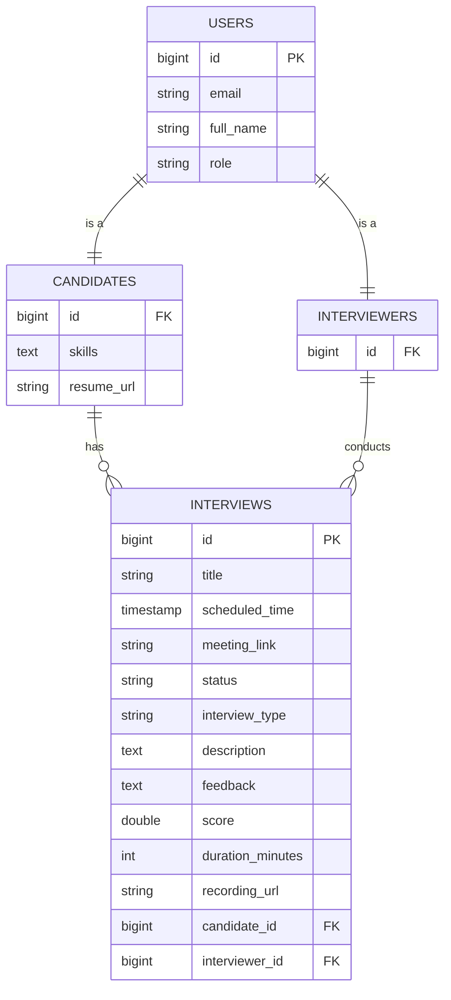

# Backend API & Database Details

## Visualizations

### Database ER Diagram

## Database Schema (PostgreSQL)

### `users` Table

| Column      | Type        | Description                                         |
| :---------- | :---------- | :-------------------------------------------------- |
| `id`        | BIGINT (PK) | Auto-increment ID                                   |
| `email`     | VARCHAR     | Unique email (Username)                             |
| `password`  | VARCHAR     | Encrypted password                                  |
| `full_name` | VARCHAR     | User's full name                                    |
| `role`      | VARCHAR     | CANDIDATE, INTERVIEWER                              |

### `candidates` Table (Extends `users`)

| Column       | Type        | Description           |
| :----------- | :---------- | :-------------------- |
| `id`         | BIGINT (FK) | References `users.id` |
| `skills`     | TEXT        | JSON/CSV of skills    |
| `resume_url` | VARCHAR     | Link to resume        |

### `interviewers` Table (Extends `users`)

| Column       | Type        | Description           |
| :----------- | :---------- | :-------------------- |
| `id`         | BIGINT (FK) | References `users.id` |

### `interviews` Table

| Column             | Type        | Description                                  |
| :----------------- | :---------- | :------------------------------------------- |
| `id`               | BIGINT (PK) | Auto-increment ID                            |
| `title`            | VARCHAR     | Interview title                              |
| `candidate_id`     | BIGINT (FK) | References `candidates.id`                   |
| `interviewer_id`   | BIGINT (FK) | References `interviewers.id`                 |
| `scheduled_time`   | TIMESTAMP   | Scheduled start time                         |
| `meeting_link`     | VARCHAR     | Unique room ID / Link                        |
| `status`           | VARCHAR     | SCHEDULED, IN_PROGRESS, COMPLETED, CANCELLED |
| `interview_type`   | VARCHAR     | TECHNICAL, BEHAVIORAL, etc.                  |
| `description`      | TEXT        | Agenda / Description                         |
| `feedback`         | TEXT        | Interviewer feedback                         |
| `score`            | DOUBLE      | Score (e.g. 1-5)                             |
| `duration_minutes` | INT         | Duration in min                              |
| `recording_url`    | VARCHAR     | URL to recording file                        |

---

## API Endpoints

### Authentication (`/api/auth`)

| Method | Endpoint  | Description       | Request Body                                          | Response     |
| :----- | :-------- | :---------------- | :---------------------------------------------------- | :----------- |
| POST   | `/signup` | Register new user | `{ "email": "...", "role": "INTERVIEWER" }`           | JWT Response |
| POST   | `/login`  | Login user        | `{ "email": "...", "password": "..." }`               | JWT Response |

### User Management (`/api/users`)

| Method | Endpoint   | Description              | Request Body | Response         |
| :----- | :--------- | :----------------------- | :----------- | :--------------- |
| GET    | `/profile` | Get current user profile | -            | `UserProfileDTO` |

### Interview Management (`/api/interviews`)

| Method | Endpoint                | Description                           | Request Body                                                                                                        | Response                                  |
| :----- | :---------------------- | :------------------------------------ | :------------------------------------------------------------------------------------------------------------------ | :---------------------------------------- |
| POST   | `/schedule`             | Schedule an interview                 | `{ "interviewerEmail", "candidateEmail", "scheduledTime", "title", "meetingLink", "description", "interviewType" }` | `Interview` object                        |
| GET    | `/session/{link}/queue` | Get session queue & status            | -                                                                                                                   | `{ "current": {...}, "timeline": [...] }` |
| POST   | `/{id}/complete`        | Mark interview as complete            | `{ "feedback": "...", "score": 4.5 }`                                                                               | Next `Interview` object (or null)         |
| GET    | `/{id}/status`          | Get specific interview status         | -                                                                                                                   | `{ "status": "..." }`                     |
| GET    | `/candidate/upcoming`   | Get upcoming interviews for candidate | `?email=...`                                                                                                        | List of `Interview` objects               |
| POST   | `/{id}/start`           | Mark interview as IN_PROGRESS         | -                                                                                                                   | 200 OK                                    |
| POST   | `/{id}/remind`          | Send reminder email                   | -                                                                                                                   | "Reminder sent"                           |
