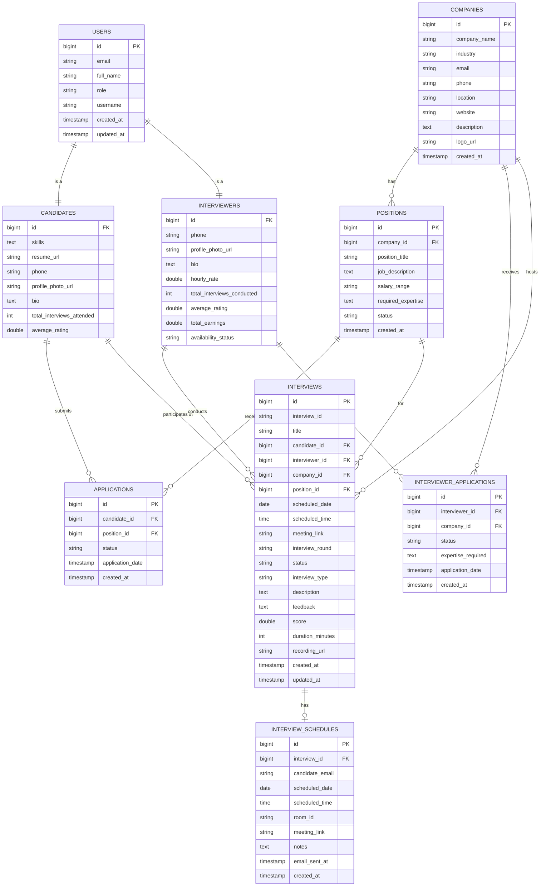

# Backend API & Database Details

## Visualizations

### Database ER Diagram

## Database Schema (PostgreSQL)

### `users` Table
| Column | Type | Description |
|:-------|:-----|:------------|
| `id` | BIGINT (PK) | Auto-increment ID |
| `email` | VARCHAR | Unique email |
| `password` | VARCHAR | Encrypted password |
| `full_name` | VARCHAR | User's full name |
| `role` | VARCHAR | CANDIDATE, INTERVIEWER |
| `username` | VARCHAR | Unique username |
| `created_at` | TIMESTAMP | Creation timestamp |
| `updated_at` | TIMESTAMP | Last update timestamp |

### `candidates` Table
| Column | Type | Description |
|:-------|:-----|:------------|
| `id` | BIGINT (FK) | References `users.id` |
| `skills` | TEXT | JSON/CSV of skills |
| `resume_url` | VARCHAR | Link to resume |
| `phone` | VARCHAR | Phone number |
| `profile_photo_url` | VARCHAR | Profile photo URL |
| `bio` | TEXT | Biography |
| `total_interviews_attended` | INT | Interview count |
| `average_rating` | DOUBLE | Average rating |

### `interviewers` Table
| Column | Type | Description |
|:-------|:-----|:------------|
| `id` | BIGINT (FK) | References `users.id` |
| `phone` | VARCHAR | Phone number |
| `profile_photo_url` | VARCHAR | Profile photo URL |
| `bio` | TEXT | Biography |
| `hourly_rate` | DOUBLE | Hourly rate |
| `total_interviews_conducted` | INT | Interview count |
| `average_rating` | DOUBLE | Average rating |
| `total_earnings` | DOUBLE | Total earnings |
| `availability_status` | VARCHAR | AVAILABLE, BUSY, OFFLINE |

### `companies` Table
| Column | Type | Description |
|:-------|:-----|:------------|
| `id` | BIGINT (PK) | Auto-increment ID |
| `company_name` | VARCHAR | Company name |
| `industry` | VARCHAR | Industry sector |
| `email` | VARCHAR | Unique email |
| `phone` | VARCHAR | Phone number |
| `location` | VARCHAR | Location |
| `website` | VARCHAR | Website URL |
| `description` | TEXT | Company description |
| `logo_url` | VARCHAR | Logo URL |
| `created_at` | TIMESTAMP | Creation timestamp |

### `positions` Table
| Column | Type | Description |
|:-------|:-----|:------------|
| `id` | BIGINT (PK) | Auto-increment ID |
| `company_id` | BIGINT (FK) | References `companies.id` |
| `position_title` | VARCHAR | Job title |
| `job_description` | TEXT | Job description |
| `salary_range` | VARCHAR | Salary range |
| `required_expertise` | TEXT | Required skills |
| `status` | VARCHAR | OPEN, CLOSED, FILLED |
| `created_at` | TIMESTAMP | Creation timestamp |

### `applications` Table
| Column | Type | Description |
|:-------|:-----|:------------|
| `id` | BIGINT (PK) | Auto-increment ID |
| `candidate_id` | BIGINT (FK) | References `candidates.id` |
| `position_id` | BIGINT (FK) | References `positions.id` |
| `status` | VARCHAR | APPLIED, SHORTLISTED, INTERVIEW_SCHEDULED, REJECTED, OFFERED |
| `application_date` | TIMESTAMP | Application date |
| `created_at` | TIMESTAMP | Creation timestamp |

### `interviewer_applications` Table
| Column | Type | Description |
|:-------|:-----|:------------|
| `id` | BIGINT (PK) | Auto-increment ID |
| `interviewer_id` | BIGINT (FK) | References `interviewers.id` |
| `company_id` | BIGINT (FK) | References `companies.id` |
| `status` | VARCHAR | APPLIED, APPROVED, REJECTED |
| `expertise_required` | TEXT | Required expertise |
| `application_date` | TIMESTAMP | Application date |
| `created_at` | TIMESTAMP | Creation timestamp |

### `interviews` Table
| Column | Type | Description |
|:-------|:-----|:------------|
| `id` | BIGINT (PK) | Auto-increment ID |
| `interview_id` | VARCHAR | Unique room ID |
| `title` | VARCHAR | Interview title |
| `candidate_id` | BIGINT (FK) | References `candidates.id` |
| `interviewer_id` | BIGINT (FK) | References `interviewers.id` |
| `company_id` | BIGINT (FK) | References `companies.id` |
| `position_id` | BIGINT (FK) | References `positions.id` |
| `scheduled_date` | DATE | Scheduled date |
| `scheduled_time` | TIME | Scheduled time |
| `meeting_link` | VARCHAR | Meeting room link |
| `interview_round` | VARCHAR | ROUND_1, ROUND_2, ROUND_3 |
| `status` | VARCHAR | SCHEDULED, IN_PROGRESS, COMPLETED, CANCELLED |
| `interview_type` | VARCHAR | TECHNICAL, BEHAVIORAL, etc. |
| `description` | TEXT | Interview description |
| `feedback` | TEXT | Interviewer feedback |
| `score` | DOUBLE | Score (e.g. 1-5) |
| `duration_minutes` | INT | Duration in minutes |
| `recording_url` | VARCHAR | Recording URL |
| `created_at` | TIMESTAMP | Creation timestamp |
| `updated_at` | TIMESTAMP | Last update timestamp |

### `interview_schedules` Table
| Column | Type | Description |
|:-------|:-----|:------------|
| `id` | BIGINT (PK) | Auto-increment ID |
| `interview_id` | BIGINT (FK) | References `interviews.id` |
| `candidate_email` | VARCHAR | Candidate email |
| `scheduled_date` | DATE | Scheduled date |
| `scheduled_time` | TIME | Scheduled time |
| `room_id` | VARCHAR | Unique room ID |
| `meeting_link` | VARCHAR | Meeting link |
| `notes` | TEXT | Additional notes |
| `email_sent_at` | TIMESTAMP | Email sent timestamp |
| `created_at` | TIMESTAMP | Creation timestamp |

## API Endpoints

### Companies (`/api/companies`)
| Method | Endpoint | Description |
|:-------|:---------|:------------|
| POST | `/` | Create company |
| GET | `/{id}` | Get company by ID |
| GET | `/` | Get all companies |
| PUT | `/{id}` | Update company |
| DELETE | `/{id}` | Delete company |

### Positions (`/api/positions`)
| Method | Endpoint | Description |
|:-------|:---------|:------------|
| POST | `/` | Create position |
| GET | `/{id}` | Get position by ID |
| GET | `/` | Get all positions |
| GET | `/company/{companyId}` | Get positions by company |
| GET | `/open` | Get open positions |
| PUT | `/{id}` | Update position |
| DELETE | `/{id}` | Delete position |

### Applications (`/api/applications`)
| Method | Endpoint | Description |
|:-------|:---------|:------------|
| POST | `/` | Create application |
| GET | `/{id}` | Get application by ID |
| GET | `/candidate/{candidateId}` | Get applications by candidate |
| GET | `/position/{positionId}` | Get applications by position |
| PATCH | `/{id}/status` | Update application status |
| DELETE | `/{id}` | Delete application |

### Interviewer Applications (`/api/interviewer-applications`)
| Method | Endpoint | Description |
|:-------|:---------|:------------|
| POST | `/` | Create interviewer application |
| GET | `/{id}` | Get application by ID |
| GET | `/interviewer/{interviewerId}` | Get applications by interviewer |
| GET | `/company/{companyId}` | Get applications by company |
| PATCH | `/{id}/status` | Update application status |
| DELETE | `/{id}` | Delete application |

### Authentication (`/api/auth`)
| Method | Endpoint | Description | Request Body |
|:-------|:---------|:------------|:-------------|
| POST | `/signup` | Register new user | `{ "email", "password", "fullName", "role" }` |
| POST | `/login` | Login user | `{ "email", "password" }` |

### Users (`/api/users`)
| Method | Endpoint | Description |
|:-------|:---------|:------------|
| GET | `/profile` | Get current user profile |

### Interviews (`/api/interviews`)
| Method | Endpoint | Description |
|:-------|:---------|:------------|
| POST | `/schedule` | Schedule an interview |
| GET | `/session/{link}/queue` | Get session queue & status |
| POST | `/{id}/complete` | Mark interview as complete |
| GET | `/{id}/status` | Get interview status |
| GET | `/candidate/upcoming` | Get upcoming interviews for candidate |
| POST | `/{id}/start` | Mark interview as IN_PROGRESS |
| POST | `/{id}/remind` | Send reminder email |

### Test (`/api/test`)
| Method | Endpoint | Description |
|:-------|:---------|:------------|
| POST | `/send-email` | Test email functionality |
